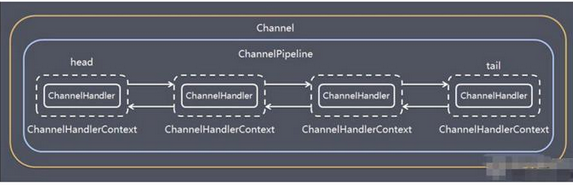

# 1. Bootstrap、ServerBootstrap

Bootstrap 意思是引导， 一个 Netty 应用通常由一个 Bootstrap 开始， 主要作用是配置整个 Netty 程序， 串联各个组件， Netty 中
Bootstrap 类是客户端程序的启动引导类， ServerBootstrap 是服务端启动引导类

# 2. Future、 ChannelFuture

Netty 中所有的 IO 操作都是异步的， 不能立刻得知消息是否被正确处理。 但是可以过一会等它执行完成或者直接注册一个监听，
具体的实现就是通过 Future 和 ChannelFutures， 他们可以注册一个监听， 当操作执行成功或失败时监听会自动触发注册的监听事件.

# 3. Channel

网格通讯的载体

1. Netty 网络通信的组件， 能够用于执行网络 I/O 操作。
1. 通过 Channel 可获得当前网络连接的通道的状态
1. 通过 Channel 可获得 网络连接的配置参数 （例如接收缓冲区大小）
1. Channel 提供异步的网络 I/O 操作(如建立连接， 读写， 绑定端口)， 异步调用意味着任何 I/O 调用都将立即返回， 并且不保证在调用结束时所请求的
   I/O 操作已完成
1. 调用立即返回一个 ChannelFuture 实例， 通过注册监听器到 ChannelFuture 上， 可以 I/O 操作成功、 失败或取消时回调通知调用方
1. 支持关联 I/O 操作与对应的处理程序
1. 不同协议、 不同的阻塞类型的连接都有不同的 Channel 类型与之对应， 常用的 Channel 类型:
    * NioSocketCannel 异步的客户端 TCP Socket 连接。NioServerSocketChannel， 异步的服务器端 TCP Socket
      连接。NioDatagramChannel， 异步的 UDP 连接。
    * NioSctpChannel， 异步的客户端 Sctp 连接。
    * NioSctpServerChannel， 异步的 Sctp 服务器端连接， 这些通道涵盖了 UDP 和 TCP 网络 IO 以及文件 IO。

# 4. Selector

1. Netty 基于 Selector 对象实现 I/O 多路复用， 通过 Selector 一个线程可以监听多个连接的 Channel 事件。
1. 当向一个 Selector 中注册 Channel 后， Selector 内部的机制就可以自动不断地查询(Select) 这些注册的,Channel 是否有已就绪的
   I/O 事件（例如可读， 可写， 网络连接完成等）,这样程序就可以很简单地使用一个线程高效地管理多个 Channel

# 5. ChannelHandler 及其实现类

1. ChannelHandler 是一个接口， 处理 I/O 事件或拦截 I/O 操作， 并将其转发到其 ChannelPipeline(业务处理链)中的下一个处理程序。
1. ChannelHandler 本身并没有提供很多方法， 因为这个接口有许多的方法需要实现， 方便使用期间， 可以继承它的子类

# 6. Pipeline 和 ChannelPipeline

是一个重点：

1. ChannelPipeline 是一个 Handler 的集合， 它负责处理和拦截 inbound 或者 outbound 的事件和操作， 相当于一个贯穿 Netty
   的链。(也可以这样理解： ChannelPipeline 是 保存 ChannelHandler 的 List， 用于处理或拦截Channel 的入站事件和出站操作)
1. ChannelPipeline 实现了一种高级形式的拦截过滤器模式， 使用户可以完全控制事件的处理方式， 以及 Channel中各个的
   ChannelHandler 如何相互交互
1. 在 Netty 中每个 Channel 都有且仅有一个 ChannelPipeline 与之对应， 它们的组成关系如下
   

# 7. ChannelHandlerContext

1. 保存 Channel 相关的所有上下文信息， 同时关联一个 ChannelHandler 对象
1. 即 ChannelHandlerContext 中 包 含 一 个 具 体 的 事 件 处 理 器 ChannelHandler ， 同 时ChannelHandlerContext 中也绑定了对应的
   pipeline 和 Channel 的信息， 方便对 ChannelHandler 进行调用.

# 8. ChannelOption

1. Netty 在创建 Channel 实例后,一般都需要设置 ChannelOption 参数。

# 9. EventLoopGroup 和其实现类 NioEventLoopGroup

1. EventLoopGroup 是一组 EventLoop 的抽象， Netty 为了更好的利用多核 CPU 资源， 一般会有多个 EventLoop同时工作， 每个
   EventLoop 维护着一个 Selector 实例。
2. EventLoopGroup 提供 next 接口， 可以从组里面按照一定规则获取其中一个 EventLoop 来处理任务。 在 Netty服 务 器 端 编 程
   中 ， 我 们 一 般 都 需 要 提 供 两 个 EventLoopGroup

# 10. Unpooled 类

1. Netty 提供一个专门用来操作缓冲区(即 Netty 的数据容器)的工具类
