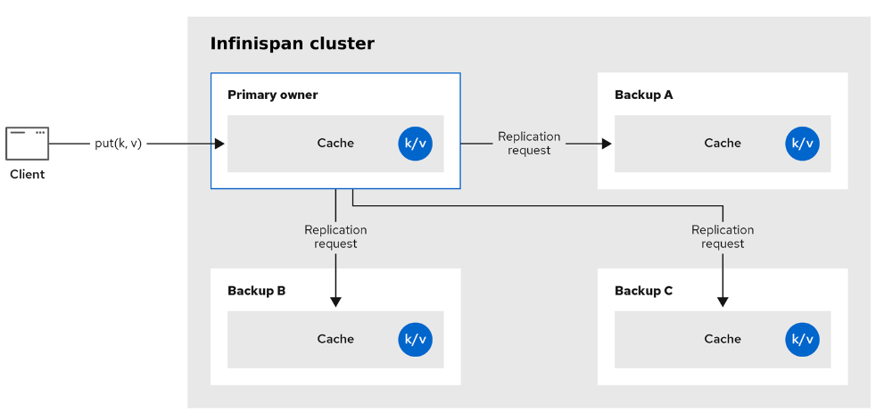
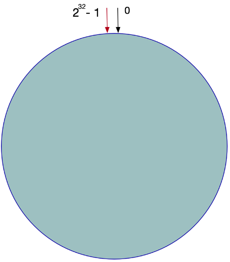
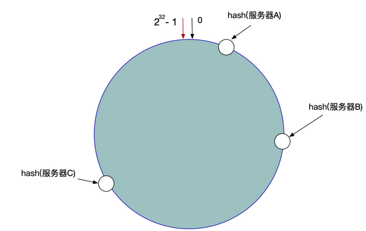
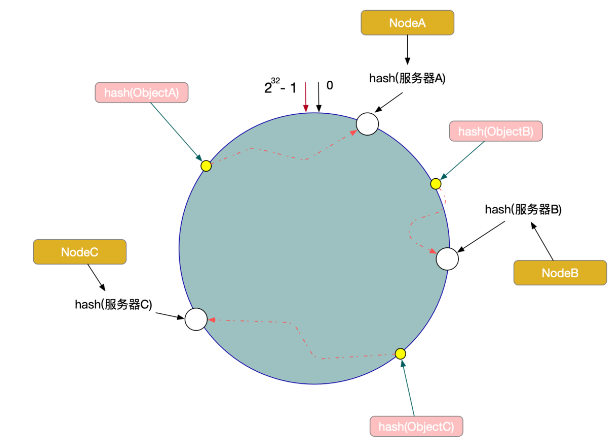
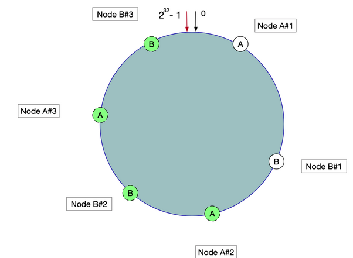

# 功能介绍

> 主要对一些工具进行整理，收集；同时也是对一些技术点的测试，会在对应的test项目进行编码

## 技术调研

* jdk动态代理
* ApplicationEvent事件机制
* disruptor高性能队列
* spring aspect拦截器
* jackson格式拦截器
* 大任务拆分的并行接口Callable
* 大任务拆分的窃取线程池ForkJoinPool

## 技术封装

* aspect 拦截器相关，timer拦截器,记录代码运行时间;repeat拦截器,主要实现代码失败后的重试功能
* encrypt 加密解密，hash,非对称，对称等
* com.lind.common.event 观察者模式，事件发布与订阅的实现，完成了对订阅者的自动初始化
* execption 异常管理，包含基类和control的异常拦截器
* jackson.convert 对springboot在http响应时,对jackson序列化的重写,`@EnableJacksonFormatting`开启自定义序列化功能
* locale 国际化组件
* opt 通过时间（TOTP）或者数量（HOTP）进行校验，一般用在二步验证上面
* rest restful接口的返回值封装
* typetools 类型处理工具
* util 工具类
  * ArrayTool 数组工具类
  * LindID 主要是对字节数据到定制化字符串的转换，设计了一种ID规范
  * BinFlagUtils 位运算
  * BinHexSwitchUtils 二进制与十六进制转换
  * ByteUtil 字符数组转换工具，对int,char,long等互转
  *
* zip 压缩工具

# 算法

* 字典树 com.lind.common.hankcs,com.lind.common.tree
* 跳跃表 com.lind.common.minibase
* 布隆过滤器 com.lind.common.minibase

# 事件处理

主要实现业务相关代码的解耦，使用了发布订阅的机制，订阅方需要实现ObjectEventListener接口，
事件相关对象需要实现ObjectEvent类型，使用方法使用ObjectEventService注入的实例即可完成事件
处理程序的注册，事件的发布也在这个对象里。

## com.lind.common.event.AbstractEvent

抽象事件源，你的事件实体对象需要实现它

## EventBusListener

事件处理程序接口，你自定义的处理程序需要实现它，它里面的实体就是继承AbstractEvent的实体

## EventBusService

事件总线接口，定义了添加事件，触发事件的方法

## DefaultEventBusBusService

默认的事件总线实现，采用内存hash表来存储事件,init()方法添加了@PostConstruct注解，完成了事件的自动注册

# 加密

## util.RSAUtils

用于非对称加密，生成公钥和私钥，可以实例前端到后端请求的敏感字符加密，把公钥给前端，然后对数据加密，在后端通过私钥进行解密，当然，
也可以用来进行签名和验证签名，过程相反，后端通过私钥生成签名，前端通过公钥去验证签名。

## util.EncryptionUtils

加密工具类，主要提供Base64,MD5,DES等加密算法

## util.JasyptUtils

主要用在配置文件的密码加密上，因为你yml文件上，有很多密码，像mysql,redis,kafka等，我们不能使用明文密码，因为通过Jasypt对配置文件里的密码
字段进行加密。
配置文件如下

```$xslt
jasypt:
  encryptor:
    password: xboot
lind:
  password: ENC(xZK4Tols08HZ5PrQYVusVbuO516ClRYK91c+HsJT0FxNvrRp+iHLAil/YqUAkO6s) #通过JasyptUtil.encyptPwd生成的
```

## JarClassLoader 自定义类加载器加载外部jar

一、类加载过程

1. 加载加载指的是将类的class文件读入到内存，并为之创建一个java.lang.Class对象，也就是说，当程序中使用任何类时，系统都会为之建立一个java.lang.Class对象。
   类的加载由类加载器完成，类加载器通常由JVM提供，这些类加载器也是前面所有程序运行的基础，JVM提供的这些类加载器通常被称为系统类加载器。除此之外，开发者可以
   通过继承ClassLoader基类来创建自己的类加载器。
   通过使用不同的类加载器，可以从不同来源加载类的二进制数据，通常有如下几种来源。
   1. 从本地文件系统加载class文件，这是前面绝大部分示例程序的类加载方式。
   2. 从JAR包加载class文件，这种方式也是很常见的，前面介绍JDBC编程时用到的数据库驱动类就放在JAR文件中，JVM可以从JAR文件中直接加载该class文件。
   3. 通过网络加载class文件。
   4. 把一个Java源文件动态编译，并执行加载。
      类加载器通常无须等到“首次使用”该类时才加载该类，Java虚拟机规范允许系统预先加载某些类。
2. 链接
   当类被加载之后，系统为之生成一个对应的Class对象，接着将会进入连接阶段，连接阶段负责把类的二进制数据合并到JRE中。
3. 初始化
   初始化是为类的静态变量赋予正确的初始值，准备阶段和初始化阶段看似有点矛盾，其实是不矛盾的，如果类中有语句：private static int a = 10，它的执行过程是这样的，首先字节码文件被加载到内存后，先进行链接的验证这一步骤，验证通过后准备阶段，给a分配内存，因为变量a是static的，所以此时a等于int类型的默认初始值0，即a=0,然后到解析（后面在说），到初始化这一步骤时，才把a的真正的值10赋给a,此时a=10。

## infinispan



## 一致性hash算法

一致性Hash算法也是使用取模的方法，不过，上述的取模方法是对服务器的数量进行取模，而一致性的Hash算法是对2的32方取模。即，一致性Hash算法将整个Hash空间组织成一个虚拟的圆环，Hash函数的值空间为0 ~ 2^32 - 1(一个32位无符号整型)，整个哈希环如下：

整个圆环以顺时针方向组织，圆环正上方的点代表0，0点右侧的第一个点代表1，以此类推。
第二步，我们将各个服务器使用Hash进行一个哈希，具体可以选择服务器的IP或主机名作为关键字进行哈希，这样每台服务器就确定在了哈希环的一个位置上，比如我们有三台机器，使用IP地址哈希后在环空间的位置如图



> 将数据Key使用相同的函数Hash计算出哈希值，并确定此数据在环上的位置，从此位置沿环顺时针查找，遇到的服务器就是其应该定位到的服务器。

例如，现在有ObjectA，ObjectB，ObjectC三个数据对象，经过哈希计算后，在环空间上的位置如下：


使用虚拟节点解决数据倾斜问题，这时我们发现有大量数据集中在节点A上，而节点B只有少量数据。为了解决数据倾斜问题，一致性Hash算法引入了虚拟节点机制，即对每一个服务器节点计算多个哈希，每个计算结果位置都放置一个此服务节点，称为虚拟节点。
具体操作可以为服务器IP或主机名后加入编号来实现，实现如图


## @ConditionalOnBean和ConditionalMissingOnBean的用法

1. @ConditionalOnMissingBean当没有其它MissingBean的bean时，就使用DefaultMissingBean这个bean.
2. @ConditionalOnBean我觉得它是一个依赖，即FishFood的注入，它依赖于是否有Fishing这个bean，如果有Fishing，就可以注册FishFood.

# SpringBoot自动装配的原理

SpringBoot自动装配的原理是基于 Spring 框架的依赖注入（DI，Dependency Injection）实现的。依赖注入是一种设计模式，它通过把依赖关系的
创建过程从应用程序中移到容器（也称为“注入器”）中来简化了应用程序代码。Spring 框架的 DI 实现提供了一个 IoC（Inversion of Control，控制反转）容器，
在这个容器中负责创建对象并管理对象之间的依赖关系。
