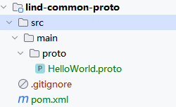

# proto文件

Proto 文件是 Protocol Buffers 的定义文件，用于定义数据结构和服务接口。Protocol Buffers
是一种轻量、高效的数据交换格式，通常用于定义跨语言、跨平台的数据通信协议。

一个简单的 proto 文件示例如下：

```protobuf
syntax = "proto3";

package tutorial;

message Person {
  string name = 1;
  int32 id = 2;
  string email = 3;
}
```

在这个示例中，我们定义了一个名为 Person 的消息类型，包括了三个字段：name、id 和 email。

### 如何使用 Proto 文件

1. **定义数据结构**：通过编写 proto 文件，你可以定义数据结构，包括消息类型、字段和其对应的数据类型。

2. **定义服务接口**：除了定义数据结构，你还可以在 proto 文件中定义 gRPC 服务接口，包括请求和响应消息类型以及对应的方法。

3. **生成代码**：一旦定义好了 proto 文件，你可以使用 Protocol Buffers 工具来生成对应语言的代码。例如，通过 `protoc`
   命令和相应的插件，可以将 proto 文件编译成 Java、C++、Go 等语言的代码文件。

4. **数据序列化和反序列化**：生成的代码文件包含了数据的序列化和反序列化方法，使得你可以方便地将数据转换成二进制格式进行传输，并在接收端进行反序列化还原成对应的数据对象。

5. **定义 gRPC 服务**：如果在 proto 文件中定义了 gRPC 服务接口，你可以使用生成的代码文件来实现服务端和客户端，从而实现基于
   gRPC 的远程过程调用。

总的来说，通过编写和使用 proto 文件，你可以定义数据结构、服务接口，并且利用生成的代码文件来实现跨语言、跨平台的数据通信和远程调用功能。

# grpc实例

* 注意，你的proto项目，需要是一个独立的项目，server和client端分别引用这个proto项目，它是一个跨语言的项目，根据不同的目标去编译成不同的包即可。
  

* lind-common-proto项目引用包

```
<dependencies>
        <dependency>
            <groupId>net.devh</groupId>
            <artifactId>grpc-spring-boot-starter</artifactId>
            <version>2.15.0.RELEASE</version>
        </dependency>
    </dependencies>

    <build>
        <extensions>
            <extension>
                <groupId>kr.motd.maven</groupId>
                <artifactId>os-maven-plugin</artifactId>
                <version>1.5.0.Final</version>
            </extension>
        </extensions>
        <plugins>
            <plugin>
                <groupId>org.xolstice.maven.plugins</groupId>
                <artifactId>protobuf-maven-plugin</artifactId>
                <version>0.5.1</version>
                <configuration>
                    <protocArtifact>com.google.protobuf:protoc:3.5.1-1:exe:${os.detected.classifier}</protocArtifact>
                    <pluginId>grpc-java</pluginId>
                    <pluginArtifact>io.grpc:protoc-gen-grpc-java:1.15.0:exe:${os.detected.classifier}</pluginArtifact>
                    <protoSourceRoot>${basedir}/src/main/proto</protoSourceRoot>
                </configuration>
                <executions>
                    <execution>
                        <goals>
                            <goal>compile</goal>
                            <goal>compile-custom</goal>
                        </goals>
                    </execution>
                </executions>
            </plugin>
        </plugins>
    </build>
```
