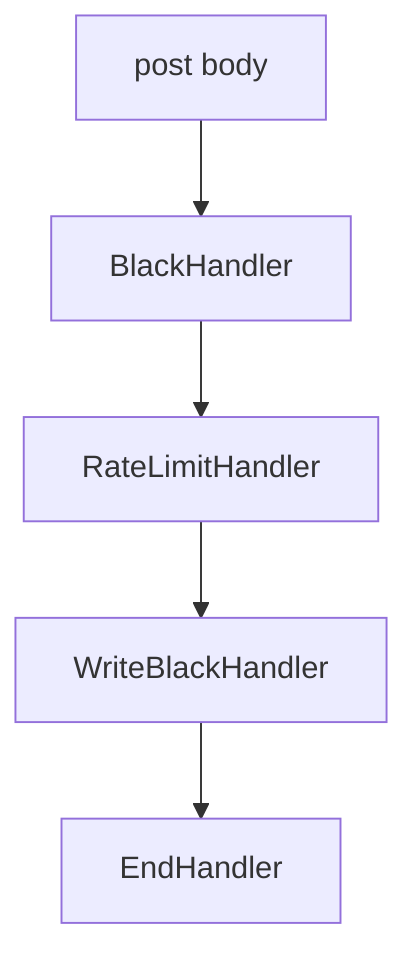

# 说明
复合的责任链，类似于管道模式，只要符合条件，说会向下传递，不会终止

# 算法说明

* 按最高优先级去使用，符合就用，不符合就走下一个策略
* 具体链条,有点像pipeline管道模式
  * BlackHandler ip=172.17.0.11
  * RateLimitHandler header=is-black
  * WriteBlackHandler header=real-black

# 继承抽象类

* AbstractHandler 抽象的责任处理者
  * 抽象方法action，需要各个子类【具体的责任处理者】自己去实现
  * final修饰的方法，封装了实现细节，子类不能重写
  * setNextHandler方法，设置下一个链条的【责任处理者】
* HandlerFactory 责任工厂
  * 通过一个责任处理列表，返回一个责任链条
  * 责任链条可以持久化到数据库里

# 责任链如果没有终止条件，就类似于pipeline管道了

