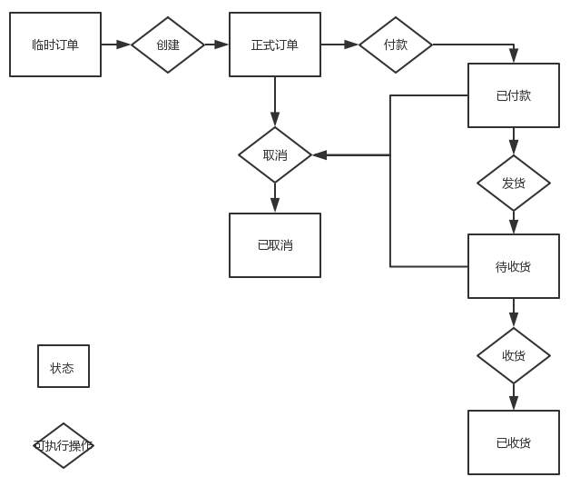
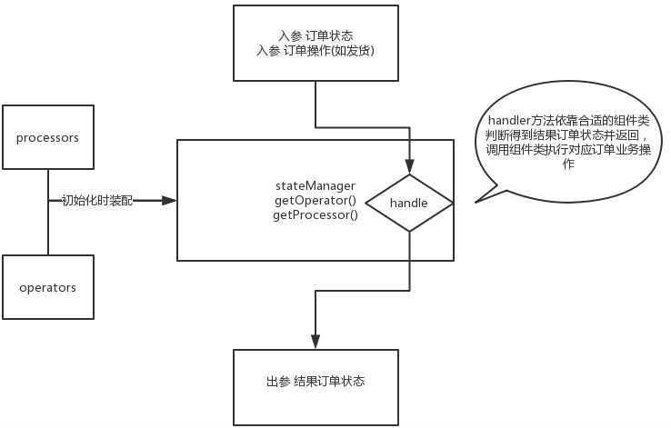

* 关于状态机设计模式一句话来归纳的话：对象的内部状态随外部执行条件的变化而变化。
* 再映射到订单状态的流转上：订单的状态，随订单当前状态和目前执行操做的组合而变化。
* 流程图

* 工作机流程

# 核心逻辑
* 核心代码部分
    * 一个管理订单状态的中转站manager类
    * 一组用于扭转订单状态的operator类
    * 一组扭转完订单状态后执行后续逻辑操做的processor类
* manager类须要根据对应传入的当前订单状态、要对该订单执行操做来获得这个订单的结果状态(依靠对应的opertor类)，而后执行一系列须要的业务逻辑操做(编写对应的processor类)。这样的好处就是将订单状态流转和对应的业务处理解耦。而且也不会再有一堆繁杂的 if...else 操做。每当须要新的订单状态流转操做的时候，能够去编写对应的一套operator和processor组件来完成，和已有业务的分离度很高。
