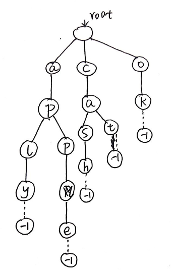
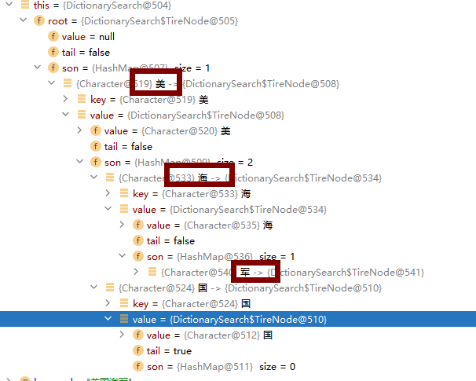
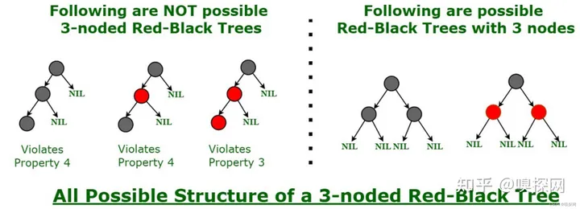

# Trie树
# 引入字典树
字典树，也叫前缀树，顾名思义，干嘛的？首先字典是干嘛的？查找字的。字典树自然也是起查找作用的，只不过是在树上找字的。为啥要在树上找字呢？因为我们都知道树上的操作更加高效。一般查找和更新操作的时间复杂度只与树的高度成正相关（貌似我们所有高效的数据结构都要往树上靠）。
我们先看一下几个问题：
1.我们输入n个单词，然后给出m个查询，每次查询一个单词，需要回答出这个单词是否在之前输入的n单词中出现过。
答：map计数（是STL中一种映射容器map<key,value>，这里key为单词，value为判断是否出现过的bool型标记），短小精悍。
好，那么下一个问题。
2.我们输入n个单词，然后给出m个查询，每次查询一个单词的前缀，需要回答出 这个前缀 是之前输入的n单词中 多少个单词的前缀？
答：我们好像还是可以用map做，把输入n个单词中的每一个单词的前缀分别存入map中，然后计数，那这样真的很麻烦而且时间、空间复杂度会非常的高。若有n个单词，平均每个单词的长度为c，那么时间复杂度就会达到nc，很容易TLE。
在实际的搜索引擎中，当我们在数据库中搜索一个关键字的时候，如何快速准确的进行定位是一个关键的问题，在面临大规模数据的时候，使用暴力的手段往往会造成检索和查找性能的低下，因此我们需要更加高效的数据结构。
这时候我们引入一种新的数据结构：Trie树（字典树）。
# 二、原理
接下来我通过举个具体的例子让大家对字典树的原理有一个清晰的认识，我对cat、cash、apple、aply、ok建立一颗字典树，如下图所示：

# 三、demo运行如图


# 红黑树
## 介绍
红黑树是一种自平衡二叉搜索树，其中每个节点都有一个额外的位，并且该位通常被解释为颜色（红色或黑色）。这些颜色用于确保树在插入和删除期间保持平衡。虽然树的平衡并不完美，但减少搜索时间并将其保持在 O(log n) 时间左右就足够了，其中 n 是树中元素的总数。这棵树是Rudolf Bayer于 1972 年发明的。

必须注意的是，由于每个节点只需要 1 位空间来存储颜色信息，这些类型的树显示与经典（未着色）二叉搜索树相同的内存占用。

## 每棵红黑树都遵循的规则：
* 每个节点都有红色或黑色的颜色。
* 树的根总是黑色的。
* 没有两个相邻的红色节点（红色节点不能有红色父节点或红色子节点）。
* 从节点（包括根）到其任何后代 NULL 节点的每条路径都具有相同数量的黑色节点。
* 所有叶子节点都是黑色节点。

## 为什么是红黑树？

大多数BST(`二叉搜索树`)操作（包括，搜索、最大值、最小值、插入、删除……等）需要 O(h) 时间，其中 h 是 BST 的高度。对于倾斜的二叉树，这些操作的成本可能会变成 O(n)。如果我们确保每次插入和删除后树的高度保持 O(log n)，那么我们可以保证所有这些操作的上限为 O(log n)。红黑树的高度及各操作的时间复杂度始终为 O(log n)，其中 n 是树中的节点数，

## 与AV树L(平衡二叉树)的比较：

与红黑树相比，AVL 树更平衡，但在插入和删除过程中可能会导致更多的旋转。因此，如果您的应用程序涉及频繁的插入和删除，那么应该首选红黑树。如果插入和删除的频率较低，而搜索是一种更频繁的操作，那么 AVL 树应该优先于红黑树。

## 红黑树如何确保平衡？

理解平衡的一个简单示例是，在红黑树中不可能有 3 个节点的链。我们可以尝试任何颜色的组合，看看它们是否都违反了红黑树属性。



```java
public class RedBlackTree<T extends Comparable<T>> {

    private Node<T> root;

    private static final boolean RED = false;
    private static final boolean BLACK = true;

    private static class Node<T> {
        T value;
        Node<T> left, right, parent;
        boolean color;

        Node(T value) {
            this.value = value;
            this.color = RED;
        }
    }

    public void insert(T value) {
        Node<T> node = new Node<>(value);
        if (root == null) {
            root = node;
        } else {
            Node<T> parent = null;
            Node<T> current = root;
            while (current != null) {
                parent = current;
                if (value.compareTo(current.value) < 0) {
                    current = current.left;
                } else {
                    current = current.right;
                }
            }
            node.parent = parent;
            if (value.compareTo(parent.value) < 0) {
                parent.left = node;
            } else {
                parent.right = node;
            }
            insertFixUp(node);
        }
    }

    private void insertFixUp(Node<T> node) {
        while (node.parent != null && node.parent.color == RED) {
            if (node.parent == node.parent.parent.left) {
                Node<T> uncle = node.parent.parent.right;
                if (uncle != null && uncle.color == RED) {
                    node.parent.color = BLACK;
                    uncle.color = BLACK;
                    node.parent.parent.color = RED;
                    node = node.parent.parent;
                } else {
                    if (node == node.parent.right) {
                        node = node.parent;
                        leftRotate(node);
                    }
                    node.parent.color = BLACK;
                    node.parent.parent.color = RED;
                    rightRotate(node.parent.parent);
                }
            } else {
                Node<T> uncle = node.parent.parent.left;
                if (uncle != null && uncle.color == RED) {
                    node.parent.color = BLACK;
                    uncle.color = BLACK;
                    node.parent.parent.color = RED;
                    node = node.parent.parent;
                } else {
                    if (node == node.parent.left) {
                        node = node.parent;
                        rightRotate(node);
                    }
                    node.parent.color = BLACK;
                    node.parent.parent.color = RED;
                    leftRotate(node.parent.parent);
                }
            }
        }
        root.color = BLACK;
    }

    private void leftRotate(Node<T> node) {
        Node<T> right = node.right;
        node.right = right.left;
        if (right.left != null) {
            right.left.parent = node;
        }
        right.parent = node.parent;
        if (node.parent == null) {
            root = right;
        } else if (node == node.parent.left) {
            node.parent.left = right;
        } else {
            node.parent.right = right;
        }
        right.left = node;
        node.parent = right;
    }

    private void rightRotate(Node<T> node) {
        Node<T> left = node.left;
        node.left = left.right;
        if (left.right != null) {
            left.right.parent = node;
        }
        left.parent = node.parent;
        if (node.parent == null) {
            root = left;
        } else if (node == node.parent.right) {
            node.parent.right = left;
        } else {
            node.parent.left = left;
        }
        left.right = node;
        node.parent = left;
    }
}
```

其中，插入操作使用insert()方法实现，该方法首先在树中插入新节点，并使用insertFixUp()方法恢复红黑树的平衡。

在insertFixUp()方法中，我们使用了左旋和右旋操作，以恢复树的平衡。当插入的节点的父节点和叔父节点都是红色时，需要进行颜色变更和旋转操作，直至树重新平衡。

至于其他操作，例如删除节点、查找节点等，可以根据需要自行实现。

使用示例：

```java
RedBlackTree<Integer> tree = new RedBlackTree<>();
tree.insert(10);
tree.insert(20);    
```
