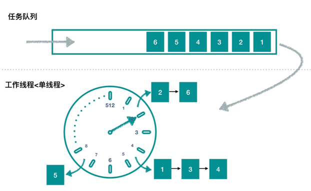
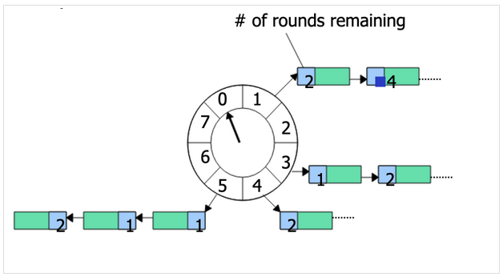

# self

* 说说时间轮的故事
* 一个圆盘，上面有刻度，刻度从0开始，如果有n个刻度，那最后一个刻度就是n-1，它后面的刻度是0 [wheelSize]
* 我们可以把时间轮盘想像成一个数组，这个数组的索引下标就是咱们轮盘上的刻度，而数组元素就是要执行的任务 [timerTaskSlots]
* 假设有8个刻度，那么刻度上的数字分别是0-7，如果当前数字是3，那它对应的刻度是2，因为刻度是从0开始的
* 如果一个数字大于刻度的最大值，例如数字是8，那么它对应的刻度刚好是0，走了一圈又回到了原点
* 如果是13这个数字，那么它对应的刻度是`13 % 8 = 5`，因为13除以8的余数是5，上面的8也适合这个算法`8 % 8 = 0`
*

上面时间轮上的刻度我们知道了，我们再让轮子转起来，事实上轮子上有个指针，是指针在按着一个速度来转，而这个速度可快可慢，可ns,ms或s [tickMs]

* 时间轮上的任务都有个延时启动时间，到了这个时间，任务就会启动 [delayMs]
* 程序启动的时间就是当前的时间戳 [startMs]，你的任务什么时候启动，可以被认为是[startMs+delayMs]
* 如果wheelSize=16，tickMs1000ms，那么你的时间轮最多可以处理的延时任务为16秒，如果你想让任务在20秒之后再执行，需要加大轮槽数量
* HashWheelTimer这种复杂的时间轮，它的延时时间与wheelSize无关
*

# 背景

HashedWheelTimer 本质是一种类似延迟任务队列的实现，适用于对时效性不高的，可快速执行的，大量这样的“小”
任务，能够做到高性能，低消耗。

时间轮是一种非常惊艳的数据结构。其在 Linux 内核中使用广泛，是 Linux 内核定时器的实现方法和基础之一。Netty
内部基于时间轮实现了一个 HashedWheelTimer 来优化 I/O 超时的检测。

因为 Netty 需要管理上万的连接，每个连接又会有发送超时、心跳检测等，如果都使用 Timer 定时器的话，将耗费大量的资源。

在 Netty 中的一个典型应用场景是判断某个连接是否 idle，如果 idle（如客户端由于网络原因导致到服务器的心跳无
法送达），则服务器会主动断开连接，释放资源。得益于 Netty NIO 的优异性能，基于 Netty 开发的服务器可以维持
大量的长连接，单台 8 核 16G 的云主机可以同时维持几十万长连接，及时掐掉不活跃的连接就显得尤其重要。

# 延迟任务方案都有哪些？优缺点？

* 数据库轮询：数据先保存在数据库中，然后启动一个定时任务，根据时间和状态将待完成的任务数据捞出来，处理
  完成后再更新数据库。这种方法比较简洁，但是依赖数据库，同时如果任务数据量很大（千万）且的话，会存在数据库
  读写性能问题，且数据库读写可能占用大量时间，甚至超过任务处理的时间。有点是数据可以持久化，服务重启不丢失，
  并且可以查询管理未完成的任务。
* DelayQueue 本质是一个 PriorityQueue，每次插入和删除都调整堆，时间复杂度是 O(longN)，而 HashedWheelTimer
  的时间复杂度是 O(1)。
* ScheduledExecutorService，JDK 的 ScheduledExecutorService 本质上仍然是一个 DelayQueue，但是任务是通过
  多线程的方式进行。

# 两种实现

* SimpleTimeWheel 一个简单的时间轮实现，用于理解时间轮的原理，添加了超过1个轮没有执行的任务，再从新放入轮中的功能
* hashwheel.HashWheelTimer 一个基于时间轮的延迟任务队列实现

# 源码分析

## 使用示例

源码分析首先通过一个使用示例开始，HashedWheelTimer 一个典型的使用方法如下：

```
@Test
public void test() throws InterruptedException {
    HashedWheelTimer wheelTimer = new HashedWheelTimer();
    wheelTimer.newTimeout(timeout -> System.out.println("1s delay"), 1, TimeUnit.SECONDS);
    wheelTimer.newTimeout(timeout -> System.out.println("10s delay"), 10, TimeUnit.SECONDS);
    wheelTimer.newTimeout(timeout -> System.out.println("11s delay"), 11, TimeUnit.SECONDS);
    TimeUnit.SECONDS.sleep(20);
}
```

在新建一个 HashedWheelTimer 对象实例后，可以向里面添加一个延迟任务，需要指定任务 TimerTask，延迟时间。

## DOC 文档

官方的 4.0 版本的 doc 文档：https://netty.io/4.0/api/io/netty/util/HashedWheelTimer.html

## Tick Duration

As described with 'approximated', this timer does not execute the scheduled TimerTask on time. HashedWheelTimer, on every tick, will check if there are any TimerTasks behind the schedule and execute them.

You can increase or decrease the accuracy of the execution timing by specifying smaller or larger tick duration in the constructor. In most network applications, I/O timeout does not need to be accurate. Therefore, the default tick duration is 100 milliseconds and you will not need to try different configurations in most cases.

## Ticks per Wheel (Wheel Size)

HashedWheelTimer maintains a data structure called 'wheel'. To put simply, a wheel is a hash table of TimerTasks whose hash function is 'dead line of the task'. The default number of ticks per wheel (i.e. the size of the wheel) is 512. You could specify a larger value if you are going to schedule a lot of timeouts.
Do not create many instances.

HashedWheelTimer creates a new thread whenever it is instantiated and started. Therefore, you should make sure to create only one instance and share it across your application. One of the common mistakes, that makes your application unresponsive, is to create a new instance for every connection.

# Implementation Details

HashedWheelTimer is based on George Varghese and Tony Lauck's paper, 'Hashed and Hierarchical Timing Wheels: data structures to efficiently implement a timer facility'. More comprehensive slides are located here.

我们可以看出，HashedWheelTimer 是一个为 I/O 超时而定制的任务调度系统。

## Timer, TimerTask, Timeout 三者的关系为：

* Timer：管理 TimerTask，HashedWheelTimer 也是实现了 Timer 接口
* TimerTask：通过上述的 Timer.newTimeout(TimerTask, long, TimeUnit) 加入，在指定时间后执行的 Task
* Timeout：持有上层的 Timer 实例，和下层的 TimerTask 实例，然后取消任务的操作也在这里面。

# 任务队列

为了保证每次 tick 不会阻塞 run 方法，每次转移的任务不超过 10w 个。这个方法所做的就是将 Queue<HashedWheelTimeout> timeouts 中的任务分配到对应的桶中，加入的逻辑就是放入对应桶链表的尾端。


* HashedWheelTimer 模拟了时间的流转，默认新建了一个长度为 512 的桶，每隔 tick 单位时间，指针向前移动。
* HashedWheelTimer 新加入的任务，会放入 Queue<HashedWheelTimeout> timeouts 队列中。
* HashedWheelTimer 内部使用一个线程，每隔 tick 单位时间处理一些逻辑，包括：
  * 处理指针当前指向桶的任务队列，如果任务到到延迟时间，就执行任务并在对应桶中删除。
  * 将 timeouts 队列的任务放入对应的桶中，每次最多处理 10w 个。

# HashedWheelTimer 的特点

* 从源码分析可以看出，其实 HashedWheelTimer 的时间精度并不高，误差能够在 100ms 左右，同时如果任务队列中的等待任务数量过多，可能会产生更大的误差。
* 但是 HashedWheelTimer 能够处理非常大量的定时任务，且每次定位到要处理任务的候选集合链表只需要 O(1) 的时间，而 Timer 等则需要调整堆，是 O(logN) 的时间复杂度。
* HashedWheelTimer 本质上是模拟了时间的轮盘，将大量的任务拆分成了一个个的小任务列表，能够有效节省 CPU 和线程资源。

# 应用场景

HashedWheelTimer本质是一种类似延迟任务队列的实现，那么它的特点就是上述所说的，适用于对时效性不高的，可快速执行的，大量这样的“小”任务，能够做到高性能，低消耗。
例如：

* 心跳检测
* session、请求是否timeout
* 业务场景则有：
  * 用户下单后发短信
  * 下单之后15分钟，如果用户不付款就自动取消订单

# 数据结构

时间轮其实就是一种环形的数据结构，可以想象成时钟，分成很多格子，一个格子代码一段时间（这个时间越短，Timer的精度越高）。并用一个链表报错
在该格子上的到期任务，同时一个指针随着时间一格一格转动，并执行相应格子中的到期任务。任务通过取摸决定放入那个格子。如下图所示：

假设一个格子是1秒，则整个wheel能表示的时间段为8s，假如当前指针指向2，此时需要调度一个3s后执行的任务，显然应该加入到(2+3=5)的方格中，
指针再走3次就可以执行了；如果任务要在10s后执行，应该等指针走完一个round零2格再执行，因此应放入4，同时将round（1）保存到任务中。
检查到期任务时应当只执行round为0的，格子上其他任务的round应减1。

再回头看看构造方法的三个参数分别代表:

* tickDuration：每一tick的时间
* timeUnit：tickDuration的时间单位
* ticksPerWheel：就是轮子一共有多个格子，即要多少个tick才能走完这个wheel一圈。
