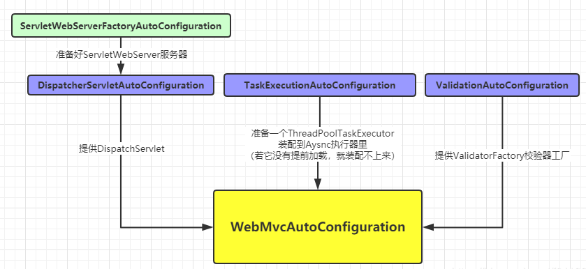
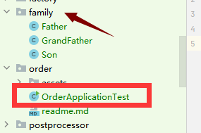
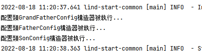

前言

Spring Boot是Spring家族具有划时代意义的一款产品，它发展自Spring Framework却又高于它，这种高于主要表现在其最重要的三大特性，而相较于这三大特性中更为重要的便是Spring Boot的自动配置（AutoConfiguration）。与其说是自动，倒不如说是“智慧”，该框架看起来好像“更聪明”了。因此它也顺理成章的成为了构建微服务的基础设施，稳坐第一宝座。

生活之道，在于取舍。程序设计何尝不是，任何决定都会是一把双刃剑，Spring Boot的自动配置解决了Spring Framework使用起来的众多痛点，让开发效率可以得到指数级提升（想一想，这不就是功德无量吗？） 。成也萧何败也萧何，也正是因为它的太智慧，倘若出了问题就会让程序设计师两眼一抹黑，无从下手。

    瑕不掩瑜，Spring Boot前进的步伐浩浩荡荡，学就完了

这不，我就在前几天收到一个“求助”，希望使用@AutoConfigureBefore来控制配置的顺序，但并未能如愿。本文就针对这个场景case稍作展开，讨论下使用@AutoConfigureBefore、@AutoConfigureAfter、@AutoCo	nfigureOrder三大注解控制自动配置执行顺序的正确姿势。

    提示：Spring Boot的自动配置是通过@EnableAutoConfiguration注解驱动的，预设是开启状态。你也可以通过spring.boot.enableautoconfiguration = false来关闭它，回退到Spring Framework时代。显然这不是本文需要讨论的内容~

正文

本文将要聊的重点是Spring Boot自动配置+ 顺序控制，自动配置大家都耳熟能详，那么“首当其冲”就是知晓这个问题：配置类的执行为何需要控制顺序？
配置类为何需要顺序？

我们已经知道Spring容器它对Bean的初始化是无序的，我们并不能想当然的通过@Order注解来控制其执行顺序。一般来说，对于容器内普通的Bean我们只需要关注依赖关系即可，而并不需要关心其绝对的顺序，而依赖关系的管理Spring的是做得很好的，这不连回圈依赖它都可以搞定么。

@Configuration配置类它也是一个Bean，但对于配置类来说，某些场景下的执行顺序是必须的，是需要得到保证的。比如很典型的一个非A即B的case：若容器内已经存在A了，就不要再把B放进来。这种case即使用中文理解，就能知道对A的“判断”必须要放在B的前面，否则可能导致程序出问题。

那么针对于配置的执行顺序，传统Spring和Spring Boot下各自是如何处理的，表现如何呢？
Spring下控制配置执行顺序

在传统的Spring Framework里，一个@Configuration注解标注的类就代表一个配置类，当存在多个@Configuration时，他们的执行顺序是由使用者靠手动指定的，就像这样：

// 手動控制Config1 Config2的順序
ApplicationContext context = new AnnotationConfigApplicationContext(Config1.class, Config2.class);


当然，你可能就疑问了说：即使在传统Spirng里，我也从没有自己使用过AnnotationConfigApplicationContext来显示载入配置啊，都是使用@Configuration定义好配置类后，点选Run一把唆的。没错，那是因为你是在web环境下使用Spring，IoC容器是借助web容器（如Tomcat等）来驱动的，Spring对此部分封装得非常好，所以做到了对使用者几乎无感知。

关于这部分的内容，此处就不深究了，毕竟本文重点不在这嘛。但可以给出给小结论：@Configuration配置被载入进容器的方式大体上可分为两种：

    手动。构建ApplicationContext时由构建者手动传入，可手动控制顺序
    自动。被@ComponentScan自动扫描进去，无法控制顺序

绝大多数情况下我们都是使用自动的方式，所以在Spring下对配置的顺序并无感知。其实这也是需求驱使，因为在传统Spring下我们并无此需求，所以对它无感是合乎逻辑的。另说一句，虽然我们并不能控制Bean的顺序，但是我们是可以干涉它的，比如：控制依赖关系、提升优先顺序、“间接”控制执行顺序…当然喽这是后面文章的内容，敬请关注。
Spring Boot下控制配置执行顺序

Spring Boot下对自动配置的管理对比于Spring它就是黑盒，它会根据当前容器内的情况来动态的判断自动配置类的载入与否、以及载入的顺序，所以可以说：Spring Boot的自动配置它对顺序是有强要求的。需求驱使，Spring Boot给我们提供了@AutoConfigureBefore、@AutoConfigureAfter、@AutoConfigureOrder（下面统称这三个注解为“三大注解”）这三个注解来帮我们解决这种诉求。

需要注意的是：三大注解是Spring Boot提供的而非Spring Framework。其中前两个是1.0.0就有了，@AutoConfigureOrder属于1.3.0版本新增，表示绝对顺序（数字越小，优先顺序越高）。另外，这几个注解并不互斥，可以同时标注在同一个@Configuration自动配置类上。
Spring Boot内建的控制配置顺序举例

为方便大家理解，我列出一个Spring Boot它自己的使用作为示例学一学。以大家最为熟悉的WebMvc的自动配置场景为例：
```
@Configuration(proxyBeanMethods = false)
@AutoConfigureOrder(Ordered.HIGHEST_PRECEDENCE + 10)
@AutoConfigureAfter({ DispatcherServletAutoConfiguration.class, TaskExecutionAutoConfiguration.class, ValidationAutoConfiguration.class })
public class WebMvcAutoConfiguration { ... }


@Configuration(proxyBeanMethods = false)
@AutoConfigureOrder(Ordered.HIGHEST_PRECEDENCE)
@AutoConfigureAfter(ServletWebServerFactoryAutoConfiguration.class)
public class DispatcherServletAutoConfiguration { ... }


@Configuration(proxyBeanMethods = false)
@AutoConfigureOrder(Ordered.HIGHEST_PRECEDENCE)
public class ServletWebServerFactoryAutoConfiguration { ... }
```


这几个配置是WebMVC的核心配置，他们之间是有顺序关系的：

    WebMvcAutoConfiguration被载入的前提是：DispatcherServletAutoConfiguration、TaskExecutionAutoConfiguration、ValidationAutoConfiguration这三个哥们都已经完成初始化
    DispatcherServletAutoConfiguration被载入的前提是：ServletWebServerFactoryAutoConfiguration已经完成初始化
    ServletWebServerFactoryAutoConfiguration被载入的前提是：@AutoConfigureOrder(Ordered.HIGHEST_PRECEDENCE)最高优先顺序，也就是说它无其它依赖，希望自己是最先被初始化的

当碰到多个配置都是最高优先顺序的时候，且互相之前没有关系的话，顺序也是不定的。但若互相之间存在依赖关系（如本利的DispatcherServletAutoConfiguration和ServletWebServerFactoryAutoConfiguration），那就按照相对顺序走



在WebMvcAutoConfiguration载入后，在它之后其实还有很多配置会尝试执行，例如：
```
@AutoConfigureAfter(WebMvcAutoConfiguration.class)
class FreeMarkerServletWebConfiguration extends AbstractFreeMarkerConfiguration { ... }

@AutoConfigureAfter(WebMvcAutoConfiguration.class)
public class GroovyTemplateAutoConfiguration { ... }

@AutoConfigureAfter({ WebMvcAutoConfiguration.class, WebFluxAutoConfiguration.class })
public class ThymeleafAutoConfiguration { ... }

@AutoConfigureAfter(WebMvcAutoConfiguration.class)
public class LifecycleMvcEndpointAutoConfiguration { ... }
```
这些都很容易理解：如果都不是Web环境，载入一些模版引擎的并无必要嘛。

# 正确的使用
1. 在不被application自动装的包中添加
2. 通过spring.factory注释这些包
3. 启动文件和几个组件不在同一个包下，所以不会被自动装，从这一点上也说明，组件注册依赖管理，主要用在start包和三方扩展包上面

4. spring.factories注册它们，完成自己装
```
org.springframework.boot.autoconfigure.EnableAutoConfiguration=\
  com.lind.common.bean.family.Father,\
  com.lind.common.bean.family.GrandFather,\
  com.lind.common.bean.family.Son
```
5. 通过结果，我们可以看到，组件依赖生效了


