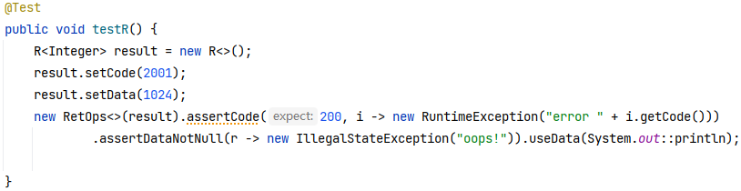

## Map图

### LinkedHashMap 
HashMap 是 Java Collection Framework 的重要成员，也是Map族(如下图所示)中
我们最为常用的一种。不过遗憾的是，HashMap是无序的，也就是说，迭代HashMap所得到的元素顺序并不是它们最初放置到HashMap的顺序。HashMap的这一
缺点往往会造成诸多不便，因为在有些场景中，我们确需要用到一个可以保持插入顺序的Map。庆幸的是，JDK为我们解决了这个问题，它为HashMap提供了一个子类
 —— `LinkedHashMap`。虽然LinkedHashMap增加了时间和空间上的开销，但是它通过维护一个额外的双向链表保证了迭代顺序。特别地，该迭代顺序可以是插入顺序，
 也可以是访问顺序。因此，根据链表中元素的顺序可以将LinkedHashMap分为：保持插入顺序的LinkedHashMap 和 保持访问顺序的LinkedHashMap，
 其中LinkedHashMap的默认实现是按插入顺序排序的。
 * 更直观地，下图很好地还原了LinkedHashMap的原貌：HashMap和双向链表的密切配合和分工合作造就了LinkedHashMap。特别需要注意的是，next用于
 维护HashMap各个桶中的Entry链，before、after用于维护LinkedHashMap的双向链表，虽然它们的作用对象都是Entry，但是各自分离，是两码事儿。


* 其中，HashMap与LinkedHashMap的Entry结构示意图如下图所示：


### SortedMap
SortedMap（java.util.SortedMap）接口是Map的子接口，SortedMap中增加了元素的排序，这意味着可以给SortedMap中的元素排序。

* NavigableMap
    * TreeMap
    * ConcurrentSkipListMap
    


#### NavigableMap
SortedMap的子接口，但是 NavigableMap接口中新加了几个SortedSet接口中没有的方法，使导航存储在映射中的键和值成为可能，本文会讲解。
既然是接口，那就必须用到它的实现，java.util包中只有一个实现 `java.util.TreeMap` ，另外java.util.concurrent包中也有实现，但是本文不讲解
```
NavigableMap original = new TreeMap();
original.put("1", "1");
original.put("2", "2");
original.put("3", "3");
```
##### TreeMap
TreeMap的实现是红黑树算法的实现, 红黑树又称红-黑二叉树，它首先是一颗二叉树，它具体二叉树所有的特性。同时红黑树更是一颗自平衡的排序二叉树。
*  平衡二叉树必须具备如下特性：它是一棵空树或它的左右两个子树的高度差的绝对值不超过1，并且左右两个子树都是一棵平衡二叉树。也就是说该二叉树的任何一个等等子节点，其左右子树的高度都相近。

*  红黑树顾名思义就是节点是红色或者黑色的平衡二叉树，它通过颜色的约束来维持着二叉树的平衡。对于一棵有效的红黑树二叉树而言我们必须增加如下规则：
1. 每个节点都只能是红色或者黑色
2. 根节点是黑色
3. 每个叶节点（NIL节点，空节点）是黑色的。
4. 如果一个结点是红的，则它两个子节点都是黑的。也就是说在一条路径上不能出现相邻的两个红色结点。
5. 从任一节点到其每个叶子的所有路径都包含相同数目的黑色节点。


* 对于红黑二叉树而言它主要包括三大基本操作：左旋、右旋、着色。
* 左旋转

* 右旋转

```
SortedMap<String, String> list = new TreeMap<>(); //基于红黑树的实现，在单线程性能不错.
list.put("a", "1");
list.put("b", "2");
list.put("c", "3");
list.put("d", "4");
SortedMap<String, String> tail = list.tailMap("c");//返回大于等于c的
Iterator<String> iterator = tail.values().iterator();
while (iterator.hasNext()) {
  System.out.println(iterator.next());
}
```
##### ConcurrentSkipListMap 
多线程下使用，支持更高的并发，ConcurrentSkipListMap 的存取时间是log（N），和线程数几乎无关，内部是SkipList（跳表）结构实现。

##### 跳跃表（SkipList）


1. 多条链构成，是关键字升序排列的数据结构；
2. 包含多个级别，一个head引用指向最高的级别，最低（底部）的级别，包含所有的key；
3. 每一个级别都是其更低级别的子集，并且是有序的；
4. 如果关键字 key在 级别level=i中出现，则，level<=i的链表中都会包含该关键字key；
```
ConcurrentSkipListMap<String, String> concurrentSkipListMap = new ConcurrentSkipListMap<>();
String a1 = concurrentSkipListMap.put("zzl", "zhangzhanling");
String a2 = concurrentSkipListMap.put("zzl1", "zhan1");
String a3 = concurrentSkipListMap.put("zzl2", "zhan2");
String a4 = concurrentSkipListMap.put("china", "中国");
System.out.printf(concurrentSkipListMap.toString());
```
# 泛型异常自定义的作用
**方法定义-显示声明**
public RetOps<T> assertCode(Integer expect, Function<? super R<T>, ? extends Exception> func)
throws Exception
**方法调用**


**方法定义-不显示声明**
public <Ex extends Exception> RetOps<T> assertCode(Integer expect, Function<? super R<T>, ? extends Ex> func)
throws Ex 
**方法调用**
不需要显示声明异常，编译器会自动推断



**解释说明**

在第一个方法中，使用了泛型类型`<Ex extends Exception>`来定义异常类型，因此在调用该方法时不需要显式声明`throws Ex`。这是因为编译器会根据实际情况推断出可能抛出的异常类型，并进行相应的处理。

而在第二个方法中，直接使用了`Exception`作为返回类型，因此在调用该方法时需要显式声明`throws Exception`，表明该方法可能会抛出Exception或其子类的异常。

通过泛型定义异常类型可以使代码更加灵活，同时也能提供更好的类型安全性。
