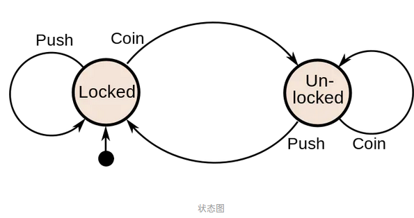

# 1 Finite-state machine
## 1.1 状态机定义
有限状态机，（英语：Finite-state machine, FSM），又称有限状态自动机，简称状态机，是表示有限个状态以及在这些状态之间的转移和动作等行为的数学模型。
有限状态机体现了两点：首先是离散的，然后是有限的。
* State：状态这个词有些难以定义，状态存储关于过去的信息，就是说它反映从系统开始到现在时刻的输入变化。
* Actions & Transitions：转换指示状态变更，并且用必须满足来确使转移发生的条件来描述它。动作是在给定时刻要进行的活动的描述。
* Guards:检测器出现的原因是为了检测是否满足从一个状态切换到另外一个状态的条件。
* Event：事件，又见事件，笼统说来，对系统重要的某件事情被称为事件。

## 1.2 事例
旋转门被视为状态机，有两种可能的状态：锁定和解锁。有两种可能影响其状态的输入：将硬币放入槽（硬币）并推动手臂（推动）。
* 在锁定状态下，推动手臂无效; 无论输入推送次数多少，它都处于锁定状态。投入硬币 - 即给机器输入硬币 - 将状态从锁定转换为解锁。
* 在解锁状态下，放入额外的硬币无效; 也就是说，给予额外的硬币输入不会改变状态。然而，顾客推动手臂，进行推动输入，将状态转回Locked。
旋转门状态机可由状态转换表表示，显示每个可能状态，它们之间的转换（基于给予机器的输入）和每个输入产生的输出：




# 2 Spring Statemachine
## 2.1 定位及特色
Spring Statemachine is a framework for application developers to use state machine concepts with Spring applications. Spring Statemachine 是应用程序开发人员在Spring应用程序中使用状态机概念的框架。
Spring Statemachine 提供如下特色：
* Easy to use flat one level state machine for simple use cases.（易于使用的扁平单级状态机，用于简单的使用案例。）
* Hierarchical state machine structure to ease complex state configuration.（分层状态机结构，以简化复杂的状态配置。）
* State machine regions to provide even more complex state configurations.（状态机区域提供更复杂的状态配置。）
* Usage of triggers, transitions, guards and actions.（使用触发器、transitions、guards和actions。）
* Type safe configuration adapter.（应用安全的配置适配器。）
* Builder pattern for easy instantiation for use outside of Spring Application context（用于在Spring Application上下文之外使用的简单实例化的生成器模式）
* Recipes for usual use cases（通常用例的手册）
* Distributed state machine based on a Zookeeper State machine event listeners.（基于Zookeeper的分布式状态机状态机事件监听器。）
* UML Eclipse Papyrus modeling.（UML Eclipse Papyrus 建模）
* Store machine config in a persistent storage.（存储状态机配置到持久层）
* Spring IOC integration to associate beans with a state machine.（Spring IOC集成将bean与状态机关联起来）

# 3 功能示例
## 3.1 基本功能
继续旋转门的现实例子，添加Maven依赖，本例子中使用版本如下：
```
<dependency>
    <groupId>org.springframework.statemachine</groupId>
    <artifactId>spring-statemachine-core</artifactId>
    <version>2.0.2.RELEASE</version>
</dependency>

//定义旋转门所处状态：锁定、解锁，使用枚举
public enum TurnstileStates {
    Unlocked, Locked
}
//定义旋转门操作事件：推门和投币，使用枚举
public enum TurnstileEvents {
    COIN, PUSH
}

```
状态机配置，其中turnstileUnlock()和customerPassAndLock()即为当前状态变更后的扩展业务操作，可以根据实际业务场景进行修改
```
@Configuration
@EnableStateMachine
public class StatemachineConfigurer extends EnumStateMachineConfigurerAdapter<TurnstileStates, TurnstileEvents> {

    @Override
    public void configure(StateMachineStateConfigurer<TurnstileStates, TurnstileEvents> states)
            throws Exception {
        states
                .withStates()
                // 初识状态：Locked
                .initial(TurnstileStates.Locked)
                .states(EnumSet.allOf(TurnstileStates.class));
    }

    @Override
    public void configure(StateMachineTransitionConfigurer<TurnstileStates, TurnstileEvents> transitions)
            throws Exception {
        transitions
                .withExternal()
                .source(TurnstileStates.Unlocked).target(TurnstileStates.Locked)
                .event(TurnstileEvents.COIN).action(customerPassAndLock())
                .and()
                .withExternal()
                .source(TurnstileStates.Locked).target(TurnstileStates.Unlocked)
                .event(TurnstileEvents.PUSH).action(turnstileUnlock())
        ;
    }

    @Override
    public void configure(StateMachineConfigurationConfigurer<TurnstileStates, TurnstileEvents> config)
            throws Exception {
        config.withConfiguration()
                .machineId("turnstileStateMachine")
        ;
    }

    public Action<TurnstileStates, TurnstileEvents> turnstileUnlock() {
        return context -> System.out.println("解锁旋转门，以便游客能够通过" );
    }

    public Action<TurnstileStates, TurnstileEvents> customerPassAndLock() {
        return context -> System.out.println("当游客通过，锁定旋转门" );
    }

}

```
启动类及测试用例
```
@SpringBootApplication
public class StatemachineApplication implements CommandLineRunner {

    @Autowired
    private StateMachine<TurnstileStates, TurnstileEvents> stateMachine;

    public static void main(String[] args) {
        SpringApplication.run(StatemachineApplication.class, args);
    }

    @Override
    public void run(String... strings) throws Exception {
        stateMachine.start();
        System.out.println("--- coin ---");
        stateMachine.sendEvent(TurnstileEvents.COIN);
        System.out.println("--- coin ---");
        stateMachine.sendEvent(TurnstileEvents.COIN);
        System.out.println("--- push ---");
        stateMachine.sendEvent(TurnstileEvents.PUSH);
        System.out.println("--- push ---");
        stateMachine.sendEvent(TurnstileEvents.PUSH);
        stateMachine.stop();
    }
}

```
结果输出，与上午所描述的状态机所描述的内容一致。
```
--- push ---
解锁旋转门，以便游客能够通过
--- push ---
--- coin ---
当游客通过，锁定旋转门
--- coin ---

```
## 3.2 实用功能
### 3.2.1 状态存储
```
@Component
public class BizStateMachinePersist implements StateMachinePersist<TurnstileStates, TurnstileEvents, Integer> {

    static Map<Integer, TurnstileStates> cache = new HashMap<>(16);

    @Override
    public void write(StateMachineContext<TurnstileStates, TurnstileEvents> stateMachineContext, Integer integer) throws Exception {
        cache.put(integer, stateMachineContext.getState());
    }

    @Override
    public StateMachineContext<TurnstileStates, TurnstileEvents> read(Integer integer) throws Exception {
        // 注意状态机的初识状态与配置中定义的一致
        return cache.containsKey(integer) ?
                new DefaultStateMachineContext<>(cache.get(integer), null, null, null, null, "turnstileStateMachine") :
                new DefaultStateMachineContext<>(TurnstileStates.Locked, null, null, null, null, "turnstileStateMachine");
    }
}

```
在StatemachineConfigurer中发布
```
@Autowired
private BizStateMachinePersist bizStateMachinePersist;

@Bean
public StateMachinePersister<TurnstileStates, TurnstileEvents, Integer> stateMachinePersist() {
    return new DefaultStateMachinePersister<>(bizStateMachinePersist);
}

```
### 3.2.2 动作监听

定义动作监听类，StatemachineMonitor（名称随意），添加注解@WithStateMachine。本例中使用id进行状态机绑定，根据文档定义，
可以使用name和id两种属性绑定需要监听的状态机实例。如果不定义任何name或者id，默认监听名称为stateMachine的状态机。
```
@WithStateMachine(id = "turnstileStateMachine")
public class StatemachineMonitor {

    @OnTransition
    public void anyTransition() {
        System.out.println("--- OnTransition --- init");
    }

    @OnTransition(target = "Unlocked")
    public void toState1() {
        System.out.println("--- OnTransition --- toState1");
    }

    @OnStateChanged(source = "Unlocked")
    public void fromState1() {
        System.out.println("--- OnTransition --- fromState1");
    }
}

```
### 3.2.2 状态机工程

实际业务环境中，往往是多线程处理不同的业务ID对应的状态，状态机中利用事件的context传递数据，会出现多线程问题，需要利用状态机工程，利用UUID创建不同状态机。

在StatemachineConfigurer类中，修改@EnableStateMachine为@EnableStateMachineFactory，同时添加状态机处理动作封装方法，读者可以根据业务场景定制，本例为一种可行方案
```
@Service
public class StatemachineService {

    @Autowired
    private StateMachinePersister<TurnstileStates, TurnstileEvents, Integer> stateMachinePersist;
    @Autowired
    private StateMachineFactory<TurnstileStates, TurnstileEvents> stateMachineFactory;

    public void execute(Integer businessId, TurnstileEvents event, Map<String, Object> context) {
        // 利用随记ID创建状态机，创建时没有与具体定义状态机绑定
        StateMachine<TurnstileStates, TurnstileEvents> stateMachine = stateMachineFactory.getStateMachine(UUID.randomUUID());
        stateMachine.start();
        try {
            // 在BizStateMachinePersist的restore过程中，绑定turnstileStateMachine状态机相关事件监听
            stateMachinePersist.restore(stateMachine, businessId);
            // 本处写法较为繁琐，实际为注入Map<String, Object> context内容到message中
            MessageBuilder<TurnstileEvents> messageBuilder = MessageBuilder
                    .withPayload(event)
                    .setHeader("BusinessId", businessId);
            if (context != null) {
                context.entrySet().forEach(p -> messageBuilder.setHeader(p.getKey(), p.getValue()));
            }
            Message<TurnstileEvents> message = messageBuilder.build();

            // 发送事件，返回是否执行成功
            boolean success = stateMachine.sendEvent(message);
            if (success) {
                stateMachinePersist.persist(stateMachine, businessId);
            } else {
                System.out.println("状态机处理未执行成功，请处理，ID：" + businessId + "，当前context：" + context);
            }
        } catch (Exception e) {
            e.printStackTrace();
        } finally {
            stateMachine.stop();
        }
    }
}

```  
