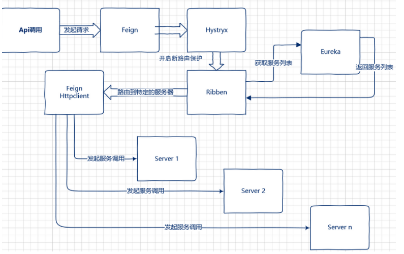

# 说明
1. 主要对feign的请求进行拦截，在请求头添加token信息
2. 自定义feign的隔离策略，实现了feign请求头的转发token,否则你的隔离级别只能是信号量SEMAPHORE

# feign-ribbon-hystrix的关系
如果微服务项目加上了`spring-cloud-starter-netflix-hystrix`依赖，那么，`feign`会通过代理模式， 自动将所有的方法用`hystrix`进行包装。
在Spring Cloud微服务体系下，微服务之间的互相调用可以通过Feign进行声明式调用，在这个服务调用过程中Feign会通过Ribbon从服务注册中心获取目
标微服务的服务器地址列表，之后在网络请求的过程中Ribbon就会将请求以负载均衡的方式打到微服务的不同实例上，从而实现Spring Cloud微服务架构中
最为关键的功能即服务发现及客户端负载均衡调用。

另一方面微服务在互相调用的过程中，为了防止某个微服务的故障消耗掉整个系统所有微服务的连接资源，所以在实施微服务调用的过程中我们会要求在调用
方实施针对被调用微服务的熔断逻辑。而要实现这个逻辑场景在Spring Cloud微服务框架下我们是通过Hystrix这个框架来实现的。

调用方会针对被调用微服务设置调用超时时间，一旦超时就会进入熔断逻辑，而这个故障指标信息也会返回给Hystrix组件，Hystrix组件会根据熔断情况判断被调微服务的故障情况从而打开熔断器，之后所有针对该微服务的请求就会直接进入熔断逻辑，直到被调微服务故障恢复，Hystrix断路器关闭为止。



# Feign典型配置说明
Feign自身可以支持多种HttpClient工具包，例如OkHttp及Apache HttpClient，针对Apache HttpClient的典型配置如下：
```
feign:
  #替换掉JDK默认HttpURLConnection实现的 Http Client
  httpclient:
    enabled: true
  hystrix:
    enabled: true
  client:
    config:
      default:
       #连接超时时间
        connectTimeout: 5000
       #读取超时时间
        readTimeout: 5000
```
# Hystrix配置说明
在Spring Cloud微服务体系中Hystrix主要被用于实现实现微服务之间网络调用故障的熔断、过载保护及资源隔离等功能。
```
hystrix:
  propagate:
    request-attribute:
      enabled: true
  command:
    #全局默认配置
    default:
      #线程隔离相关
      execution:
        timeout:
          #是否给方法执行设置超时时间，默认为true。一般我们不要改。
          enabled: true
        isolation:
          #配置请求隔离的方式，这里是默认的线程池方式。还有一种信号量的方式semaphore，使用比较少。
          strategy: threadPool
          thread:
            #方式执行的超时时间，默认为1000毫秒，在实际场景中需要根据情况设置
            timeoutInMilliseconds: 10000
            #发生超时时是否中断方法的执行，默认值为true。不要改。
            interruptOnTimeout: true
            #是否在方法执行被取消时中断方法，默认值为false。没有实际意义，默认就好！
            interruptOnCancel: false
  circuitBreaker:   #熔断器相关配置
    enabled: true   #是否启动熔断器，默认为true，false表示不要引入Hystrix。
    requestVolumeThreshold: 20     #启用熔断器功能窗口时间内的最小请求数，假设我们设置的窗口时间为10秒，
    sleepWindowInMilliseconds: 5000    #所以此配置的作用是指定熔断器打开后多长时间内允许一次请求尝试执行，官方默认配置为5秒。
    errorThresholdPercentage: 50   #窗口时间内超过50%的请求失败后就会打开熔断器将后续请求快速失败掉,默认配置为50

```
# Ribbon配置说明
Ribbon在Spring Cloud中对于支持微服之间的通信发挥着非常关键的作用，其主要功能包括客户端负载均衡器及用于中间层通信的客户端。在基于Feign的
微服务通信中无论是否开启Hystrix，Ribbon都是必不可少的，Ribbon的配置参数主要如下：
```
ribbon:
  eager-load:
    enabled: true
  #说明：同一台实例的最大自动重试次数，默认为1次，不包括首次
  MaxAutoRetries: 1
  #说明：要重试的下一个实例的最大数量，默认为1，不包括第一次被调用的实例
  MaxAutoRetriesNextServer: 1
  #说明：是否所有的操作都重试，默认为true
  OkToRetryOnAllOperations: true
  #说明：从注册中心刷新服务器列表信息的时间间隔，默认为2000毫秒，即2秒
  ServerListRefreshInterval: 2000
  #说明：使用Apache HttpClient连接超时时间，单位为毫秒
  ConnectTimeout: 3000
  #说明：使用Apache HttpClient读取的超时时间，单位为毫秒
  ReadTimeout: 3000
```
如上图所示，在Spring Cloud中使用Feign进行微服务调用分为两层：Hystrix的调用和Ribbon的调用，Feign自身的配置会被覆盖。
而如果开启了Hystrix，那么Ribbon的超时时间配置与Hystrix的超时时间配置则存在依赖关系，因为涉及到Ribbon的重试机制，所以一般情况下都是
Ribbon的超时时间小于Hystrix的超时时间，否则会出现以下错误：
```
2019-10-12 21:56:20,208   111231 [http-nio-8084-exec-2] WARN    o.s.c.n.z.f.r.s.AbstractRibbonCommand - The Hystrix 
timeout of 10000ms   for the command operation is set lower than the combination of the Ribbon   read and connect timeout, 24000ms. 
```
