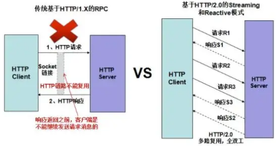
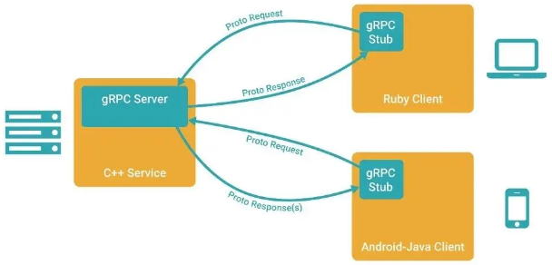
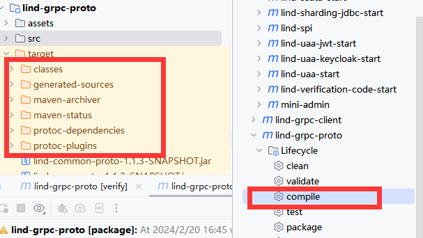

# 简介
在 gRPC 里，客户端应用可以像调用本地对象一样直接调用另一台不同的机器上服务端应用的方法，使得我们能够更容易地创建分布式应用和服务。

gRPC 基于 HTTP/2 标准设计，带来诸如双向流、流控、头部压缩、单 TCP 连接上的多复用请求等。这些特性使得其在移动设备上表现更好，更省电和节省空间占用。
目前有非常多优秀的开源项目采用 gRPC 作为通信方式，例如说 Kubernetes、SkyWalking、istio 等等。甚至说，Dubbo 自 2.7.5 版本之后，开始提供对 gRPC 协议的支持

gRPC 主要提供了新增两种 RPC 调用方式：
* 普通 RPC 调用方式，即请求 - 响应模式。
* 基于 HTTP/2.0 的 streaming 调用方式。

gRPC 服务调用支持同步和异步方式，同时也支持普通的 RPC 和 streaming 模式，可以最大程度满足业务的需求。

streaming 模式，可以充分利用 HTTP/2.0 协议的多路复用功能，实现在一条 HTTP 链路上并行双向传输数据，有效的解决了 HTTP/1.X 的数据单向传输问题，在大幅减少 HTTP 连接的情况下，充分利用单条链路的性能，可以媲美传统的 RPC 私有长连接协议：更少的链路、更高的性能。

gRPC 的网络 I/O 通信基于 Netty 构建，服务调用底层统一使用异步方式，同步调用是在异步的基础上做了上层封装。因此，gRPC 的异步化是比较彻底的，对于提升 I/O 密集型业务的吞吐量和可靠性有很大的帮助。

netty采用多路复用的 Reactor 线程模型：基于 Linux 的 epoll 和 Selector，一个 I/O 线程可以并行处理成百上千条链路，解决了传统同步 I/O 通信线程膨胀的问题。NIO 解决的是通信层面的异步问题，跟服务调用的异步没有必然关系。

# gRPC实现步骤：
1. 定义一个服务proto，指定其能够被远程调用的方法（包含参数、返回类型）
2. 在服务端实现这个接口，并运行一个 gRPC 服务器来处理客户端请求
3. 在客户端实现一个存根 Stub ，用于发起远程方法调用
4. gRPC 客户端和服务端可以在多种语言与环境中运行和交互！我们可以很容易地用 Java 创建一个 gRPC 服务端，用 Java、Go、Python、Ruby 来创建 gRPC 客户端来访问它。

# proto项目
你的server和client项目都依赖于它，它会定义服务，服务参数，服务返回值等等
**依赖包**
* 引入 grpc-protobuf 依赖，使用 Protobuf 作为序列化库。
* 引入 grpc-stub 依赖，使用 gRPC Stub 作为客户端。

**依赖插件**
* 引入 os-maven-plugin 插件，从 OS 系统中获取参数。因为需要通过它从 OS 系统中获取 os.detected.classifier 参数。
* 引入 protobuf-maven-plugin 插件，实现将proto 目录下的protobuf 文件，生成Service 和 

点击 IDEA 的「compile」按钮，编译 spring-boot-bulking-grpc-proto 项目，并同时执行 protobuf-maven-plugin 插件进行生成。结果如下图所示：

