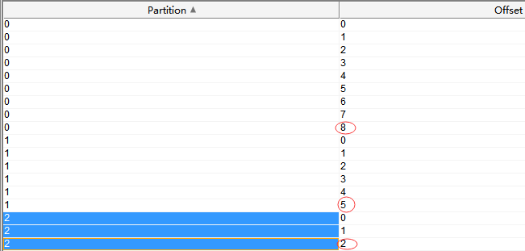
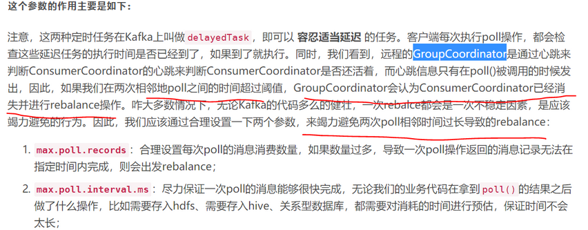
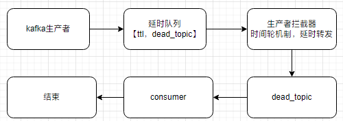

# 作用

* 对生产者producer封装，统一发送消息
* 添加aop模块，对发消息时进行拦截，对公用字段统一赋值
* 添加当前用户接口`CurrentUserAware`，由使用者去实现它
* 去掉了kafka-receiver包，感觉封装意义不大
* 使用时先添加注解`@EnableMqKafka`
* 添加了标识接口MessageEntityAware，避免了topic消息体的格式僵化，MessageEntity做为默认的消息体，自己可以添加新的MessageEntityAware实现

# kafka explorer说明

## topic

从这里可以看到消息的分区，序列化，可以发新消息

## consumer

从这里可以看到这个消费者，对于某个topic的消费进度，主要以下几个参数

* topic 对应的消息名
* partition 对应的消息所在的分区
* start 这个消费者从哪个位置开始消费的
* end 消息的总长度
* offset 当前消费的偏移量
* lan 未消费的消息
* last commit 最后提交时间
*

# 依赖引用

```
<dependency>
    <groupId>com.pkulaw</groupId>
    <artifactId>pkulaw-kafka-start</artifactId>
    <version>1.0.0</version>
</dependency>
```

# 添加了统一的traceId，来自于主线程的MDCTraceId

通过MDC.getCopyOfContextMap()方式将当前线程上的对象传递到回调方法中，再通过MDC.setContextMap()方式将对象设置到子线程中。

# 配置

* 使用spring-kafka的标准配置即可
* 添加了统一的消费者拦截器，需要通过配置进行开启

```
spring.kafka.consumer.interceptor-classes: com.lind.kafka.ConumerInterceptorTTL
```

# 使用

统一的消息体，直接为操作人和时间赋值

```
@Component
public class CurrentUserAwareImpl implements CurrentUserAware {
    @Override
    public String getCurrentUserName() {
        return "lind";
    }

    @Override
    public String getCurrentUserId() {
        return "1";
    }
}
```

随意定义自己的消息对象

```
@Data
public class UserDTO {
    private String title;
}

```

基于注解的发布者

```
@MqProducer
public interface MessageDataSend {
    @MqSend(topic = "ok_bobo")
    void sendDataMessage(MessageEntity<UserDTO> messageEntity);
}
```

基于注解的消费者

```
@KafkaListener(topics = "ok_bobo", groupId = "default")
public void messageReceive(String message) {
    MessageEntity<UserDTO> userDTOMessageEntity = objectMapper.readValue(
            message,
            new TypeReference<MessageEntity<UserDTO>>() {
            });
    System.out.println("default" + userDTOMessageEntity.getData());
}
```

# spring代理

* 对接口进行代理，不能有实现类，主要效仿在mybatis的实现
* 一般代理一个基接口，然后由不同的泛型子接口去继承它，从而代理这些子接口，完成统一的处理

# 代理的注册

* 使用springboot提供的注解直接注册
* 实现spring的`ImportBeanDefinitionRegistrar`,`FactoryBean`等接口完成注册

# 默认实现与附加行为

* 添加接口默认实现类
* 添加附加接口类，一般理解为回调方法的接口，或者函数式接口
* 使用者直接自定自己的接口，但需要声明`@MessageProvider`和`@MessageSend`注解，以便让代理可以找到你

# 分区partition

1. 每个partition有自己的offset
2. 单个partition里的消息是有序的
3. 多个partition对于同组的不同消费者来说，是并行的，非阻塞的
   

# 重复消费



1. 消费任务执行时间长
2. max.poll.interval.ms设置太小，比任务执行时间还小
3. 当出现了上面情况时，由于任务执行时间长，在任务没有被commit之前，消费者又进行了poll操作，导致了重复消费

> 一般情况下，kafka重复消费都是由于未正常提交offset，故修改配置，正常提交offset即可解决。上文中提到的主要配置如下所示：

```
/* 自动确认offset的时间间隔  */
props.put("auto.commit.interval.ms", "1000");
props.put("session.timeout.ms", "30000");
//消息发送的最长等待时间.需大于session.timeout.ms这个时间
props.put("request.timeout.ms", "40000");
//一次从kafka中poll出来的数据条数
//max.poll.records条数据需要在在session.timeout.ms这个时间内处理完
props.put("max.poll.records","100");
//两个poll的时间间隔
props.put("max.poll.interval.ms",1000);
//server发送到消费端的最小数据，若是不满足这个数值则会等待直到满足指定大小。默认为1表示立即接收。
props.put("fetch.min.bytes", "1");
//若是不满足fetch.min.bytes时，等待消费端请求的最长等待时间
props.put("fetch.wait.max.ms", "1000");
```

# 延时消息

通过ProducerInterceptor拦截器对目标消息（包含了TTL和DEAD_TOPIC)
进行延时转发，例如在30分钟之后转发到目标队列，通常被称为dead_topic的死信队列上面，而由死信队列的消费者来处理这些消息，从而达到了延时处理的目的。


* ProducerInterceptorTTL源码

```
public class ProducerInterceptorTTL implements ProducerInterceptor<Integer, String>, ApplicationContextAware {

	// 消息延时,单位秒
	public static String TTL = "ttl";

	// 死信队列,延时后发送到的队列，我们称为死信队列
	public static String DEAD_TOPIC = "dead_topic";

	// 静态化的上下文，用于获取bean，因为ConsumerInterceptor是通过反射创建的，所以无法通过注入的方式获取bean
	private static ApplicationContext applicationContext;

	// 时间轮，用于延时发送消息
	private static LindTimeWheel timeWheel = new LindTimeWheel(1000, 8);

	@Override
	public ProducerRecord onSend(ProducerRecord<Integer, String> record) {
		final String topic = record.topic();
		final Integer partition = record.partition();
		final Integer key = record.key();
		final String value = record.value();
		final Long timestamp = record.timestamp();
		final Headers headers = record.headers();
		long ttl = -1;
		String deadTopic = null;
		for (Header header : headers) {
			if (header.key().equals(TTL)) {
				ttl = toLong(header.value());
			}
			if (header.key().equals(DEAD_TOPIC)) {
				deadTopic = new String(header.value());
			}
		}
		// 消息超时判定
		if (deadTopic != null && ttl > 0) {
			// 可以放在死信队列中
			String finalDeadTopic = deadTopic;
			long finalTtl = ttl * 1000;
			timeWheel.addTask(() -> {
				System.out.println("消息超时了," + finalTtl + "需要发到topic:" + record.key());
				KafkaTemplate kafkaTemplate = applicationContext.getBean(KafkaTemplate.class);
				kafkaTemplate.send(finalDeadTopic, record.value());

			}, finalTtl);
		}
		// 拦截器拦下来之后改变原来的消息内容
		ProducerRecord<Integer, String> newRecord = new ProducerRecord<Integer, String>(topic, partition, timestamp,
				key, value, headers);
		// 传递新的消息
		return newRecord;

	}

	@Override
	public void onAcknowledgement(RecordMetadata recordMetadata, Exception e) {

	}

	@Override
	public void close() {

	}

	@Override
	public void configure(Map<String, ?> map) {

	}

	@Override
	public void setApplicationContext(ApplicationContext applicationContext) throws BeansException {
		this.applicationContext = applicationContext;
	}

}
```

* 通过application.yml进行拦截器的配置

```
spring:
  kafka:
    producer:
      properties:
        interceptor.classes: com.ruoyi.lawyer.delay.ProducerInterceptorTTL
```
