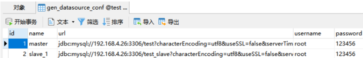

本组件支持mybatis和mybatis-plus
# 原理

mybatis在执行sql前通过数据源去找数据库连接-->`determineCurrentLookupKey`
（AbstractRoutingDataSource）；所以通过注解拦截方法，在调用之前动态切换数据源名称即可。切换数据源，就要先给spring注入这些定义好的数据源，也就是程序中自定义的类`DynamicDataSource`
的实例。所以问题就转换成了怎么准备多个数据源。通过`DruidConfig`
中注入数据源，其中共性的属性由DruidProperties设置，各个数据源的特有属性根据注解ConfigurationProperties设置。最后，由于不同的请求是在不同的线程中的，可能去请求不同的数据源，所以这里要使用ThreadLocal保证现场安全来切换数据源名称。

# mybatis-plus插件dynamic-datasource-spring-boot-starter



## 动态数据源

1. 一个有意思的问题，如果希望将a库的数据备份到b库，两个库结构完全相同，这时可以使用动态数据源功能，在读方法走a数据源，写方法走b数据源。
2. 另外，对于代码生成器来说，也可以通过动态数据源，动态选择数据库和数据表
3. 动态数据源，可以实现数据库`读写分离`，读操作走备用数据源，通过@DS("slave1")表声明对应的读方法

## 实现方式

本组件通过将动态数据源配置到数据表中，通过数据表里的连接串来加载数据源，通过@DS注释来标识方法要使用的数据源、在启动类中开启功能`@EnableDynamicDataSource`


## 声明动态数据源类或者方法

> 声明了@DS注解的方法或者类，它将走动态数据源的拦截

```
@DS("#last")
Map<String, String> queryTable(@Param("tableName") String tableName, String dsName);
```

## 建立mapper.xml文件，如读取表信息列表

```
<select id="queryTable" resultType="map">
		select table_name tableName, engine, table_comment tableComment, create_time createTime from information_schema.tables
			where table_schema = (select database()) and table_name = #{tableName}
</select>
```

## 原生的动态数据源通过配置文件注入

```yml
spring:
  datasource:
    dynamic:
      primary: master #设置默认的数据源或者数据源组,默认值即为master
      strict: false #严格匹配数据源,默认false. true未匹配到指定数据源时抛异常,false使用默认数据源
      datasource:
        master:
          url: jdbc:mysql://192.168.4.26:3306/test?characterEncoding=utf8&useSSL=false&serverTimezone=Asia/Shanghai&rewriteBatchedStatements=true
          username: root
          password: 123456
          driver-class-name: com.mysql.cj.jdbc.Driver
        slave_1:
          url: jdbc:mysql://192.168.4.26:3306/test_slave?characterEncoding=utf8&useSSL=false&serverTimezone=Asia/Shanghai&rewriteBatchedStatements=true
          username: root
          password: 123456
          driver-class-name: com.mysql.cj.jdbc.Driver
```

## 配置文件密码加密

```
spring:
  application:
    name: @artifactId@
  datasource:
    type: com.zaxxer.hikari.HikariDataSource
    driver-class-name: com.mysql.cj.jdbc.Driver
    username: root
    password: ENC(e6ytx260Dh8EfNszc7ktxg==)
    url: jdbc:mysql://localhost:3306/pig_codegen?characterEncoding=utf8&useSSL=false&serverTimezone=Asia/Shanghai&rewriteBatchedStatements=true

# 加解密根密码
jasypt:
  encryptor:
    password: pig #根密码
```
