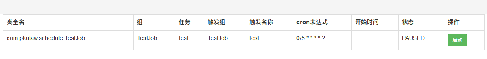

# 作用
主要处理定时任务的业务，方便对接任务调度框架

# 依赖引用
```
<dependency>
    <groupId>com.lind</groupId>
    <artifactId>lind-schedule</artifactId>
    <version>1.0.0</version>
</dependency>
```
# 配置文件
```
org.quartz.threadPool.class= org.quartz.simpl.SimpleThreadPool
org.quartz.threadPool.threadCount= 5
org.quartz.threadPool.threadPriority= 5
org.quartz.threadPool.threadsInheritContextClassLoaderOfInitializingThread= true
org.quartz.jobStore.misfireThreshold= 5000
org.quartz.jobStore.class= org.quartz.impl.jdbcjobstore.JobStoreTX
org.quartz.jobStore.tablePrefix= QRTZ_
org.quartz.jobStore.dataSource=qzDS
org.quartz.dataSource.qzDS.driver= com.mysql.jdbc.Driver
org.quartz.dataSource.qzDS.URL= jdbc:mysql://192.168.4.26:3306/quartz?useUnicode=true&characterEncoding=UTF-8
org.quartz.dataSource.qzDS.user= root
org.quartz.dataSource.qzDS.password= 123456
org.quartz.dataSource.qzDS.maxConnections= 10
```
# 使用
定义业务处理任务
```
public class TestDynamicJob implements Job {
    @Override
    public void execute(JobExecutionContext jobExecutionContext) throws JobExecutionException {
    // 业务逻辑
    }
}
```
可以在VI上添加任务调度的策略
* 任务列表：/quartz-view/list
* 截图

