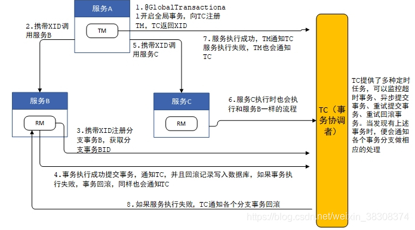

# 部署
```
docker run --name=seata1.4.2 \
        --hostname=d67502e1d2ea \
        --mac-address=02:42:0a:ff:fe:02 \
        --env=SEATA_IP=192.168.60.136 \
        --env=SEATA_PORT=8091 \
        --volume=/root/seata/seata-server-1.4.2/conf/registry.conf:/seata-server/resources/registry.conf \
        --volume=/root/seata/seata-server-1.4.2/conf/file.conf:/seata-server/resources/file.conf \
        --volume=/root/dev/docker/seata/logs:/root/logs \
        --workdir=/seata-server \
        -p 8091:8091 \
        --restart=no \
        --runtime=runc \
        --detach=true \
        -t \
        seataio/seata-server:1.4.2

```
# 说明
* 两个微服务
* micro-order为订单服务
* micro-product为商品服务
* 下单成功后，会扣商品服务的库存
* 库存成功后，会一起提交，失败后，会回滚

# 分布式事务术语
* TC (Transaction Coordinator) - 事务协调者，维护全局和分支事务的状态，驱动全局事务提交或回滚。
* TM (Transaction Manager) - 事务管理器，定义全局事务的范围：开始全局事务、提交或回滚全局事务。
* RM (Resource Manager) - 资源管理器，管理分支事务处理的资源，与TC交谈以注册分支事务和报告分支事务的状态，并驱动分支事务提交或回滚。

# 四种分布式事务模式
* AT 模式是无侵入的分布式事务解决方案，适用于不希望对业务进行改造的场景，几乎0学习成本。
* TCC 模式是高性能分布式事务解决方案，适用于核心系统等对性能有很高要求的场景。
* Saga 模式是长事务解决方案，适用于业务流程长且需要保证事务最终一致性的业务系统，Saga 模式一阶段就会提交本地事务，无锁，长流程情况下可以保证性能，多用于渠道层、集成层业务系统。事务参与者可能是其它公司的服务或者是遗留系统的服务，无法进行改造和提供 TCC 要求的接口，也可以使用 Saga 模式。
* XA模式是分布式强一致性的解决方案，但性能低而使用较少。
* Seata默认是AT模式
seata涉及到三个角色之间的交互，本文通过流程图将AT模式下的基本交互流程梳理一下，为我们以后的解析打下基础。
  假设有三个微服务，分别是服务A、B、C，其中服务A中调用了服务B和服务C，TM、TC、RM三者之间的交互流程如下图：


1. 服务A启动时，GlobalTransactionScanner会对有@GlobalTransaction注解的方法进行AOP增强，并生成代理，增强的代码位于GlobalTransactionalInterceptor类中，当调用@GlobalTransaction注解的方法时，增强代码首先向TC注册全局事务，表示全局事务的开始，同时TC生成XID，并返回给TM；
2. 服务A中调用服务B时，将XID传递给服务B；
3. 服务B得到XID后，访问TC，注册分支事务，并从TC获得分支事务ID，TC根据XID将分支事务与全局事务关联；
4. 接下来服务B开始执行SQL语句，在执行前将表中对应的数据保存一份，执行后在保存一份，将这两份记录作为回滚记录写入到数据库中，如果执行过程中没有异常，服务B最后将事务提交，并通知TC分支事务成功，服务B也会清除本地事务数据；
5. 服务A访问完服务B后，访问服务C；
6. 服务C与TC之间的交互与服务B完全一致；
7. 服务B和服务C都成功后，服务A通过TM通知TC全局事务成功，如果失败了，服务A也会通知TC全局事务失败；
8. TC记录了全局事务下的每个分支事务，TC收到全局事务的结果后，如果结果成功，则通知RM成功，RM收到通知后清理之前在数据库中保存的回滚记录，如果失败了，则RM要查询出之前在数据库保存的回滚记录，对之前的SQL操作进行回滚。
> 因为TM、RM、TC之间的交互都是通过网络完成的，很容易出现网络断开的情况，因此TC提供了四个定时线程池，定时检测系统中是否有超时事务、异步提交事务、回滚重试事务、重试提交事务，如果发现了有这四类事务，则从全局事务中获取所有的分支事务，分别调用各个分支事务完成对应的操作，依次来确保事务的一致性。

## 需要考虑的问题：
通过上面流程的分析可以发现，每次SQL操作（查询除外）时，都会增加额外了三次数据库操作；每次全局事务和分支事务开启时，都涉及到TM、RM与TC的交互；全局事务期间还要承担数据短时不一致的情况，这些都是我们在使用AT模式需要考虑的情况。
