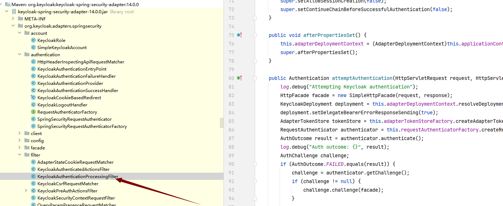

文章目录
* 对接KC统一认证中心-Springboot版
  * pom.xml添加引用
  * 相关配置
  * 实现相关接口
* 几种认证接口
  * 配置信息说明
  * 授取码混合认证
  * 微信unionId认证
  
* scope授权思路
  * 之前的尝试MappingJackson2HttpMessageConverter
  * JsonSerializer的实现

> 目前框架只支持springboot2.3.x，如果使用最新的springboot2.7.x，会出现循环引用的问题

# 前后分离项目
```
keycloak.bearer-only: true #如果没有权限直接401，前后分离项目使用它，当后端返回401时，前端自己去KC认证，这个值为false时，属于前后一体模块，将会进行跳转KC登录
```
## token有效性校验
对于我们项目来说，只要集成了keycloak-spring-boot-starter包，它就已经有了校验token合法性的能力了；当然如果你需要校验token的在线性，
还是需要自己写一个方法，在org.keycloak.adapters.rotation.JWKPublicKeyLocator中实现了公钥的获取，
org.keycloak.adapters.rotation.AdapterTokenVerifier中完成了对token的校验；springboot在集成它之后，
通过org.keycloak.adapters.springsecurity.filter.KeycloakAuthenticationProcessingFilter对请求进行了拦截，通过
org.keycloak.adapters.BearerTokenRequestAuthenticator实例来完成请求过程的验证。

> 一个非法的token，它将直接返回401，不会进行我们的页面
* 开启某个包的日志级别，方便查看原码执行过程
```
logging:
  level:
    # 全局日志级别
    root: info
    # 具体到某个类的日志级别，打印所有访问请求日志
    org.keycloak.adapters.springsecurity.filter: debug
```

* 开入户中某个包的
# 对接KC统一认证中心-Springboot版
## pom.xml添加引用
```
<dependencyManagement>
    <dependencies>
          <dependency>
            <groupId>org.keycloak.bom</groupId>
            <artifactId>keycloak-adapter-bom</artifactId>
            <version>14.0.0</version>
            <type>pom</type>
            <scope>import</scope>
        </dependency>
    </dependencies>
</dependencyManagement>
<dependency>
    <groupId>com.pkulaw</groupId>
    <artifactId>pkulaw-uaa-keycloak-start</artifactId>
    <version>1.0.0</version>
</dependency>
```
## 相关配置
```$xslt

keycloak:
  auth-server-url: http://devcas.pkulaw.com:18081/auth # kc服务器地址
  realm: demo # 域名称
  resource: demoproduct # 客户端（接入方）名称
  client-key-password: ec0fd1c6-68b0-4c39-a9fa-c3be25c8ef01 # 客户端密钥，非远程授权时，可以只使用这个
  credentials.secret: ec0fd1c6-68b0-4c39-a9fa-c3be25c8ef01 # 客户端密钥，远程授权时（policy-enforcer-config.enforcement-mode: ENFORCING），需要使用它
  public-client: true # 如果设置为true，则适配器不会将客户端的凭据发送到Keycloak。 这是可选的。 默认值为false。
  principal-attribute: preferred_username
  use-resource-role-mappings: false # 如果设置为true，则适配器将在令牌内部查找用户的应用程序级角色映射。 如果为false，它将查看用户角色映射的领域级别。 这是可选的。 默认值为false。
  cors: true
  uaa:
    permitAll: /users # 开放的地址，它们将会被动调用`kc-session`这个接口完成用户状态同步
    redirectUri: http://192.168.3.181:9090/about # 回调地址，token会追加在这个地址上，为空表示直接在页面上输出token
```
## 实现相关接口
主要是指角色与你的权限的对应关系，如果由使用方去实现这两个接口，将用户对应的角色返回即可，你可以对你的实现方法采用缓存的设计及提高性能。
```$xslt
@Data
@AllArgsConstructor
@NoArgsConstructor
public class Permission implements SourcePermission {

    /**
     * 菜单标题.
     */
    private String title;
    /**
     * 页面路径/资源链接url.
     */
    private String path;
    /**
     * 权限名称
     */
    private String auth;

}
@Service
public class PermissionServiceImpl implements PermissionService {
    
@Service
public class PermissionServiceImpl implements PermissionService {

    /**
     * 被保存的api资源.
     *
     * @return
     */
    @Override
    public List<ResourcePermission> getAll() {
        return Arrays.asList(
                new Permission("商品管理", "/products"),
                new Permission("用户管理", "/users"),
                new Permission("商品删除", "/data/sifa*"),
                new Permission("律所实务", "/data/lvsuo*"),
                new Permission("法学期刊", "/data/faxue*")
        );
    }

    @Override
    public List<ResourcePermission> getByRoleId(String roleKey) {
        if (roleKey.equals("商品管理员"))
            return Arrays.asList(
                    new Permission("商品管理", "/products"),
                    new Permission("商品添加", "/products/add"),
                    new Permission("商品删除", "/products/del")
            );
        else if (roleKey.equals("司法案例")) {
            return Arrays.asList(
                    new Permission("商品删除", "/data/sifa*")
            );
        } else if (roleKey.equals("律所实务")) {
            return Arrays.asList(
                    new Permission("律所实务", "/data/lvsuo*")
            );
        } else if (roleKey.equals("法学期刊")) {
            return Arrays.asList(
                    new Permission("法学期刊", "/data/faxue*")
            );
        }
        return null;
    }

}

```

# 几种认证接口
## 配置信息说明
* 配置组件`UaaProperties`，对应配置文件中的字段`uaa`
* 业务端的回调地址`redirectUri`，在拿到token之后会重定向到这个页面，url上带着token,redirectUri为空时，直接将token响应到页面上
* 不需要认证就可以访问的接口，使用`permitAll`来配置，即白名单列表
> 例子，下面配置实现了当登录成功之后重定向到`http://192.168.3.181:9090/about`页面，对/about接口开放访问
```
keycloak:
  uaa:
    permitAll: /about
    redirectUri: http://192.168.3.181:9090/about
```

## 授取码混合认证
* 用户在kc登录表单成功之后，会有一个客户端回调，在这个回调时，我们可以获取code和token信息
* 通过`KeycloackAuthenticationProcessingFilterPostProcessor`组件实现了自定义回调接口，以下是两个固定的回调接口，都完成了对code和token的获取功能
    * 带有重定向功能的接口`/token/authorizationCodeRedirect`
    * 认证成功后，直接将token信息输出的接口`token/authorizationCodeResponse` 
* 通过`KeycloakSessionStateInterceptor`组件，实现了对同一浏览器登录的用户状态的同步，它会与kc服务端进行通讯 

## bearer-only配置
bearer-only: true表示当没有权限时，会直接返回401，而不会跳到KC去，这一般用到前后分离的项目中
## 多端登录的共享状态接口
* https://devcas.pkulaw.com:18081/auth/realms/fabao/sms/kc-sessions?client={clientName}&redirect_uri=http://192.168.3.181:9090/token/authorizationCodeRedirect&refer_uri=http://192.168.3.181:9090/about
上面接口将实现同一浏览器，多个客户端应用的共享登录，下面介绍一下相关参数
* client:客户端名称
* redirect_uri: kc回调客户端的统一地址，是一个固定的地址
* refer_uri: 业务回调地址，是一个动态的地址，可以理解为在redirect_uri里处理完成之后，再跳到这个地址

## 微信unionId认证
* 通过微信的unionId做为参数，调用接口`token/applet`，来完成认证
* 认证成功后，回调接口使用`token/authorizationCodeResponse`，直接将token输出到浏览器
* 需要在kc管理平台为`WechatApplet`客户端指定unionId的认证流程，如图

* 在应用程序的配置文件中，也需要配置对接的WechatApplet作为你的客户端
```
keycloak:
  auth-server-url: http://192.168.4.26:8080/auth
  realm: fabao
  resource: WechatApplet
  credentials: #这个键请注意远程授权需要使用这个，而不能使用client-key-password
      secret: ec0fd1c6-68b0-4c39-a9fa-c3be25c8ef01
```
* 调用/token/applet?unionId=oPBM51E0XEdxUOSvH3Y17ollctS0,结果如图


# scope授权思路
通过实现JsonSerializer抽象类的serialize方法来进行指定类型的序列化，在序列化中对持有ScopeSet注解的字段进行解析，当没有对象的scope时，
对字段不进行渲染，从而保护了字段资源。

## 之前的尝试MappingJackson2HttpMessageConverter
之前使用`MappingJackson2HttpMessageConverter`的定义，将@ScopeSet进行检查，并对字段按着scope值进行输出，最后的结果是失败的，因为
`MappingJackson2HttpMessageConverter`只在程序启动时执行一次，将类对应的字段添加到它的字典之后，如果下次有相同的实体字段，就不会去再执行
MappingJackson2HttpMessageConverter了，而我们要求的是每次序列化时都需要进行重新的解析，以查询当前用户的scope是否有对应的权限。

## JsonSerializer的实现
接口在每次从服务端响应时都需要使用jackson的JsonSerializer功能，它有默认的实现方式，而我们可以重新去实现自己的方法，它在每次接口响应时都会被执行
ScopeSet

```$xslt
@Target({ElementType.FIELD})
@Retention(RetentionPolicy.RUNTIME)
public @interface ScopeSet {
    /**
     * 授权范围.
     *
     * @return
     */
    String value() default "";
}

```
ScopeJsonSerializer序列化
```$xslt
@Slf4j
public class ScopeJsonSerializer<T> extends JsonSerializer<T> {
    @SneakyThrows
    @Override
    public void serialize(T t, JsonGenerator jsonGenerator, SerializerProvider serializerProvider) throws IOException {
        //引用类型
        jsonGenerator.writeStartObject();
        for (Field field : t.getClass().getDeclaredFields()) {
            field.setAccessible(true);
            if (field.getAnnotation(ScopeSet.class) != null) {
                String value = field.getAnnotation(ScopeSet.class).value();
                if (Arrays.asList(SecurityUser.getScope()).contains(value)) {
                    jsonGenerator.writeObjectField(field.getName(), field.get(t));
                }
            } else {
                jsonGenerator.writeObjectField(field.getName(), field.get(t));
            }
        }
        jsonGenerator.writeEndObject();
    }
}
```
在DTO实体中使用，先在实体上声明注解`@JsonSerialize(using = ScopeJsonSerializer.class)`，之后在需要保护的字段上添加@ScopeSet注解即可

# kafka和redis配置
```yaml
keycloak:
  uaa:
    kafka.enabled: true
    cache.redis.enabled: true
```
