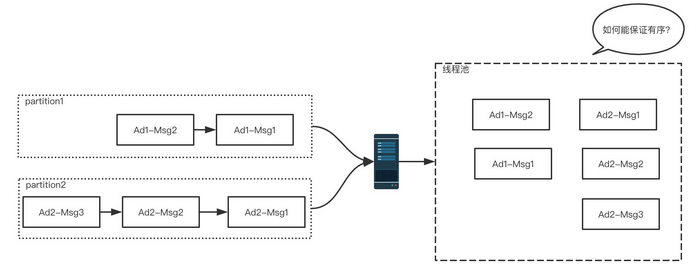
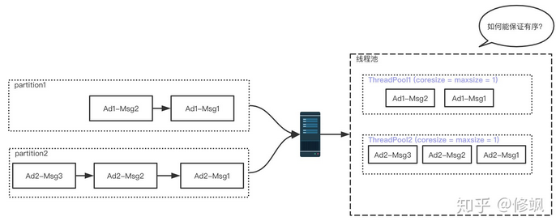

# 线程池如何保证有序？

# 背景
在生产环境中，用kafka来解耦是常用的技术手段。为了保证消息的顺序处理，会把相同属性(同一个人、同一个素材等) 的消息发往kafka同一个partition中。例如，在广告系统中，会把某一个ad的转化数据发送到同一个partition。
```
Ad1 -> [Ad1-msg1, Ad1-msg2, ...] -> 顺序发到partition1
Ad2 -> [Ad2-msg1, Ad2-msg2, ...] -> 顺序发到partition2
...
```
这样做的初衷是希望对于同一个广告的消息，不要出现消费的时候先后顺序错乱。

但是这里有一个速度不匹配的问题——Consumer处理的速度往往是远远小于Consumer拉取消息的速度的，于是很多人就会想到用多线程加速。但是这会带来一个问题：同一个Ad的消息先后顺序错乱，背离我们的初衷。由此，引出我们今天的问题：线程池如何保证有序。

# 问题思考

上面我们分析的思路是通过线程池来加速消息的处理，而消息顺序错乱也是由于引入线程池带来的。有一种方法比较简单粗暴且有效，加Partition，增加Consumer，每个Consumer使用单线程来处理。但是如果消息太多，部署成本就会上升，所以回到了线程池如何保证有序上来。我们希望实现这样一个线程池：
```
private final Executor<Integer> executor = xxx;
 
void consumer(MyDto dto) { // kafka消费逻辑的入口
  executor.executeEx(dto.getUserId(), () -> {
    // 实际消费逻辑
    // 相同的dto.getAdId()会保证是按照入队顺序串行执行
  });
}
```
已经有同学实现好了，github地址：KeyAffinityExecutor，在研究源码之前，笔者思考了如果自己要实现这样一个线程池，那我会怎么考虑？
1. 把相同key的msg只交给一个线程去处理，那就保证了它的顺序性；
2. 不同key的msg交给不同的线程去处理；

下面我们逐一来看这两个问题：
1. 关于把相同key的msg交给一个线程去处理，同时不想频繁的创建和销毁一个线程。我们可以声明一个核心线程数和最大线程数都是1的线程池即可：
```
LinkedBlockingQueue<Runnable> queue = new LinkedBlockingQueue<>();
ExecutorService executor = new ThreadPoolExecutor(1, 1,..., queue);
// 其中queue为阻塞队列
``` 
2. 不同key的msg交给不同的线程去处理。

这条比较好理解，如果来了一个key，查看是不是有对应的线程池处理它。有，那么扔到上面声明的线程池中；没有，选择(新建)线程池来处理。

最终的实现原理如下图所示，最终我们的这个线程池里面会包含多个核心线程数=最大线程数=1的小线程池。

# 源码解读

最关键的两个方法:
```
public interface KeyAffinity<K, V> extends AutoCloseable, Iterable<V> {
    // 核心方法, 从一个key选出线程池, 对应我们上面说的第1点.
    V select(K key);
    // 当每一个key执行完之后回收处理这个key的线程池.
    void finishCall(K key);
}
```
KeyAffinity 的实现类：
```
class KeyAffinityImpl<K, V> implements KeyAffinity<K, V> {
    public V select(K key) {
        KeyRef keyRef = mapping.compute(key, (k, v) -> {
            if (v == null) {
            // 如果当前没有相同的key处理的, 那么就new一个线程池(选择最空闲的线程池).
                ...
            }
            v.incrConcurrency();
            // 如果有相同的key, 那么返回这个线程池并处理.
            return v;
        });
        
        return keyRef.ref();
    }
​
    @Override
    public void finishCall(K key) {
        // 对于每一个key如果处理完了, 那么会清空.
        mapping.computeIfPresent(key, (k, v) -> {
            if (v.decrConcurrency()) {
                return null;
            } else {
                return v;
            }
        });
    }
}
```
KeyAffinityExecutor 线程池执行主体:
```
public interface KeyAffinityExecutor<K> extends KeyAffinity<K, ListeningExecutorService> {
    // 构造线程池.
    static <K> KeyAffinityExecutor<K> newSerializingExecutor(...) {
        return newKeyAffinityExecutor()
                .count(parallelism)
                .executor(new Supplier<ExecutorService>() {
​
                    @Override
                    public ExecutorService get() {
                        LinkedBlockingQueue<Runnable> queue;
                        if (queueBufferSize > 0) {
                            queue = new LinkedBlockingQueue<Runnable>(queueBufferSize) {
                              
                                @Override
                                public boolean offer(Runnable e) {
                                    try {
                                        // 1. put方法让提交任务的线程阻塞.
                                        put(e);
                                        return true;
                                    } catch (InterruptedException ie) {
                                        Thread.currentThread().interrupt();
                                    }
                                    return false;
                                }
                            };
                        } else {
                            queue = new LinkedBlockingQueue<>();
                        }
                        // 2.声明核心线程数=最大线程数的线程池 
                        return new ThreadPoolExecutor(1, 1, 0L, MILLISECONDS, queue, threadFactory);
                    }
                })
                .build();
    }
​
    default void executeEx(K key, @Nonnull ThrowableRunnable<Exception> task) {
        checkNotNull(task);
        // 1. 选择相应的线程池
        ListeningExecutorService service = select(key);
        boolean addCallback = false;
        try {
            // 2. 提交任务.
            service.execute(() -> {
                try {
                    task.run();
                } catch (Throwable e) { // pass to uncaught exception handler
                    throwIfUnchecked(e);
                    throw new UncheckedExecutionException(e);
                } finally {
                   // 3.该任务执行完成后check对于该key对应的线程池要不要清空
                    finishCall(key);
                }
            });
            addCallback = true;
        } finally {
            
            if (!addCallback) {
                finishCall(key);
            }
        }
    }
}
```
上面三个类，是实现该线程池最核心的三个方法，有兴趣的同学沿着我所列出的核心方法，可以看整个实现的技巧。祝进步！