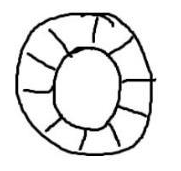
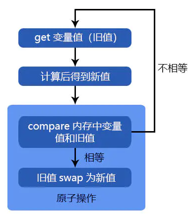
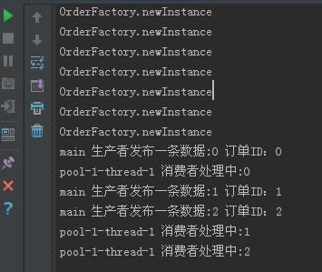
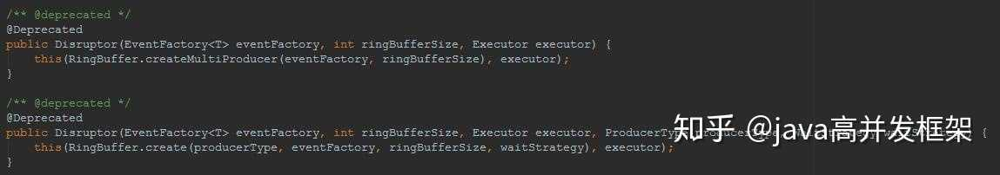
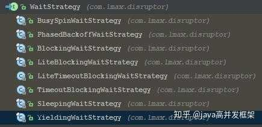
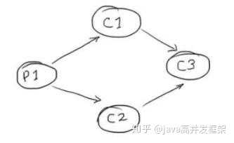
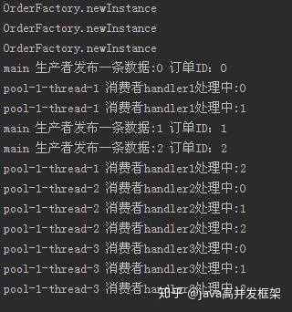
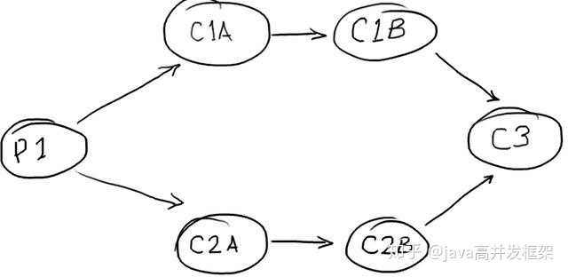

Disruptor英国外汇交易公司LMAX开发的一个高性能队列，号称“一个线程一秒钟可以处理600W个订单“，https://link.zhihu.com/?target=https%3A//github.com/LMAX-Exchange/disruptor/releases
# 事件数据源
LongEvent
# 事件数据源工厂 
LongEventFactory，实现了EventFactory
# 事件生产者
LongEventProducer，向RingBuffer这个环形缓冲区里生产数据
* 第一步：先从 RingBuffer 获取下一个可以写入的事件的序号；
* 第二步：获取对应的事件对象，将数据写入事件对象；
* 第三部：将事件提交到 RingBuffer;
> 生产者在生产数据时，需要从RingBuffer里取到可用的节点，如果消费者比较慢时，有可能把所有RingBuffer都占完，这时，生产者会出现阻塞情况，当有空闲节点时，数据才会进行新的生产。
# 事件订阅者
LongEventHandler，实现了EventHandler，从RingBuffer里拿数据
# Disruptor
* 对订阅者来说，它的绑定是通过disruptor完成的，还可以控制订阅者的顺序和依赖关系
* 对发布者来说，通过disruptor对象说发布事件
* Disruptor里会有对RingBuffer的引用，生产者需要这个`RingBuffer`对象，用来获取节点，为节点赋值，和发布等

# 轮胎：RingBuffer
RingBuffer，环形缓冲区，在disruptor中扮演着非常重要的角色，理解RingBuffer的结构有利于我们理解disruptor为什么这么快、无锁的实现方式、生产者/消费者模式的实现细节。如下图所示：


# 数组
这个类似于轮胎的东西实际上就是一个数组，使用数组的好处当然是由于预加载的缘故使得访问比链表要快的多。

# 序号
RingBuffer中元素拥有序号的概念，并且序号是一直增长的，这怎么理解？比如RingBuffer大小为10，那么序号从0开始增长，当到9的时候，相当于转了一圈，如果继续增长的话，那么将覆盖0号元素。也即是说通过 序号%SIZE 来定位元素，实现set/get操作。这里也发现了和队列不同的一个方式，就是不存在元素的删除操作，只有覆盖而已，实际上RingBuffer的这种特别的环形存储方式，使得不需要花费大量的时间用于内存清理/垃圾回收。

由于涉及到取模操作，为了CPU进行位运算更加高效，RingBuffer的大小应该是2的N次方。

# 锁的机制
在生产者/消费者模式下，disruptor号称“无锁并行框架”（要知道BlockingQueue是利用了Lock锁机制来实现的），这是怎么做到的呢？下面我们来具体分析下：

* 一个生产者 + 一个消费者

生产者维护一个生产指针P，消费者维护一个消费者指针C，当然P和C本质上就是序号。2者各操作各的，不需要锁，仅仅需要注意的是生产者和消费者的速度问题，当然这个在disruptor内部已经为我们做了处理，就是判断一下P和C之间不能超过一圈的大小。

* 一个生产者 + 多个消费者

多个消费者当然持有多个消费指针C1，C2，...，消费者依据C进行各自读取数据，只需要保证生产者的速度“协调”最慢的消费者的速度，就是那个不能超出一圈的概念。此时也不需要进行锁定。

* 多个生产者 + N个消费者

很显然，无论生产者有几个，生产者指针P只能存在一个，否则数据就乱套了。那么多个生产者之间共享一个P指针，在disruptor中实际上是利用了CAS机制来保证多线程的数据安全，也没有使用到锁。

* CAS机制
实现原子操作还可以使用CAS实现原子操作，利用了处理器提供的CMPXCHG指令来实现的，每一个CAS操作过程都包含三个运算符：一个内存地址V，一个期望的值A和一个新值B，操作的时候如果这个地址上存放的值等于这个期望的值A，则将地址上的值赋为新值B，否则不做任何操作。

CAS的基本思路就是，如果这个地址上的值和期望的值相等，则给其赋予新值，否则不做任何事，但是要返回原值是多少。循环CAS就是在一个循环里不断的做cas操作，直到成功为止。下面的代码实现了一个CAS线程安全的计数器safeCount。
```java
public class Counter {
    private AtomicInteger atomicCount = new AtomicInteger(0);
    private int i = 0;

    /** cas cafecount **/
    private void safeCount() {
        for (; ; ) {
            int i = atomicCount.get();
            boolean suc = atomicCount.compareAndSet(i, ++i);
            if (suc) {
                break;
            }
        }
    }

    public static void main(String[] args) {
        Counter cas = new Counter();
        List<Thread> ts = new ArrayList<>(500);
        long start = System.currentTimeMillis();
        for (int j = 0; j < 100; j++) {
            Thread t = new Thread(() -> {
                for (int i = 0; i < 10000; i++) {
                    cas.safeCount();
                }
            });
            ts.add(t);
        }
        for (Thread t : ts) {
            t.start();
        }
        for (Thread t : ts) {
            try {
                t.join();
            } catch (InterruptedException e) {
                e.printStackTrace();
            }
        }
        System.out.println(cas.i);
        System.out.println(cas.atomicCount.get());
        System.out.println(System.currentTimeMillis() - start);
    }
}

```
CAS是怎么实现线程的安全呢？语言层面不做处理，我们将其交给硬件—CPU和内存，利用CPU的多处理能力，实现硬件层面的阻塞，再加上volatile变量的特性（可见性，有序性）即可实现基于原子操作的线程安全。
# CAS实现原子性操作的三大问题
在Java并发包中有一些并发框架也使用了自旋CAS的方式来实现原子操作，比如LinkedTransferQueue类的xfer方法。CAS虽然很高的解决了原子操作，但是CAS仍然存在三大问题。ABA问题、循环时间长开销大、以及只能保证一个共享变量的原子操作。
> 从java1.5开始，JDK提供了AtomicStampedReference、AtomicMarkableReference来解决ABA的问题，通过compareAndSet方法检查值是否发生变化以外检查版本号知否发生变化。（AtomicStampedReference能够得到变化的次数这里下边会介绍到） 

# Disruptor初体验：简单的生产者和消费者
* 业务数据对象POJO（Event）
```java
public class Order {

    //订单ID
    private long id;

    //订单信息
    private String info;

    //订单价格
    private double price;

    public long getId() {
        return id;
    }

    public void setId(long id) {
        this.id = id;
    }

    public String getInfo() {
        return info;
    }

    public void setInfo(String info) {
        this.info = info;
    }

    public double getPrice() {
        return price;
    }

    public void setPrice(double price) {
        this.price = price;
    }
}
```
* 业务数据工厂(Factory)
```java
public class OrderFactory implements EventFactory{

    @Override
    public Object newInstance() {

        System.out.println("OrderFactory.newInstance");
        return new Order();
    }

}
```
* 事件处理器(Handler，即消费者处理逻辑)
```java
public class OrderHandler implements EventHandler<Order>{

    @Override
    public void onEvent(Order order, long l, boolean b) throws Exception {

        System.out.println(Thread.currentThread().getName() + " 消费者处理中:" + l);
        order.setInfo("info" + order.getId());
        order.setPrice(Math.random());
    }

}
```
* 测试
```java
public class Main {

    public static void main(String[] args) throws InterruptedException {

        //创建订单工厂
        OrderFactory orderFactory = new OrderFactory();

        //ringbuffer的大小
        int RINGBUFFER_SIZE = 1024;

        //创建disruptor
        Disruptor<Order> disruptor = new Disruptor<Order>(orderFactory,RINGBUFFER_SIZE,Executors.defaultThreadFactory());

        //设置事件处理器 即消费者
        disruptor.handleEventsWith(new OrderHandler());

        disruptor.start();

        RingBuffer<Order> ringBuffer = disruptor.getRingBuffer();

        //-------------生产数据
        for(int i = 0 ; i < 3 ; i++){

            long sequence = ringBuffer.next();

            Order order = ringBuffer.get(sequence);

            order.setId(i);

            ringBuffer.publish(sequence);
            System.out.println(Thread.currentThread().getName() + " 生产者发布一条数据:" + sequence + " 订单ID：" + i);
        }

        Thread.sleep(1000);

        disruptor.shutdown();
    }

}
```
* 运行结果：



* 说明：
其实上面的结果已经很明显的说明了，在初始阶段构造Disruptor的时候，会调用工厂Factory去实例化RingBuffer中的Event数据对象。

另外在构造Disruptor的时候，在3.3.6之前使用的是API：

到了3.3.6这些API都不推荐使用了，即不再推荐传入Executor这样的线程池，而是推荐传入ThreadFactory线程工厂。这样的话，关闭disruptor就会自动关闭Executor线程池，而不需要像以前那样必须在关闭disruptor的时候再关闭线程池了。

构造Disruptor时，需要注意ProducerType（SINGLE or MULTI 指示是单个生产者还是多个生产者模式）、WaitStrategy（策略选择，决定了消费者如何等待生产者）。



# 单独使用RingBuffer：WorkerPool

如果场景比较简单，我们完全可以不用创建Disruptor，而是仅仅使用RingBuffer功能。
```java
public static void main(String[] args)  throws InterruptedException {
    ExecutorService executor = Executors.newFixedThreadPool(3);
    RingBuffer<Order> ringBuffer = RingBuffer.create(ProducerType.SINGLE,new OrderFactory(),1024,new YieldingWaitStrategy());
    WorkerPool<Order> workerPool = new WorkerPool<Order>(ringBuffer,ringBuffer.newBarrier(),new IgnoreExceptionHandler(),new OrderHandler());
    workerPool.start(executor);
    //-------------生产数据
    for(int i = 0 ; i < 30 ; i++){
        long sequence = ringBuffer.next();
        Order order = ringBuffer.get(sequence);
        order.setId(i);
        ringBuffer.publish(sequence);
        System.out.println(Thread.currentThread().getName() + " 生产者发布一条数据:" + sequence + " 订单ID：" + i);
    }
    Thread.sleep(1000);
    workerPool.halt();
    executor.shutdown();

}

```
实际上是利用WorkerPool辅助连接消费者。

# 一个生产者+多个消费者


```java
public static void main(String[] args) throws InterruptedException {

    //创建订单工厂
    OrderFactory orderFactory = new OrderFactory();

    //ringbuffer的大小
    int RINGBUFFER_SIZE = 1024;

    //创建disruptor
    Disruptor<Order> disruptor = new Disruptor<Order>(orderFactory,RINGBUFFER_SIZE,Executors.defaultThreadFactory());

    //设置事件处理器 即消费者
    EventHandlerGroup<Order> eventHandlerGroup = disruptor.handleEventsWith(new OrderHandler(),new OrderHandler2());
    eventHandlerGroup.then(new OrderHandler3());
    disruptor.start();

    RingBuffer<Order> ringBuffer = disruptor.getRingBuffer();

    //-------------生产数据
    for(int i = 0 ; i < 3 ; i++){

        long sequence = ringBuffer.next();

        Order order = ringBuffer.get(sequence);

        order.setId(i);

        ringBuffer.publish(sequence);
        System.out.println(Thread.currentThread().getName() + " 生产者发布一条数据:" + sequence + " 订单ID：" + i);
    }

    Thread.sleep(1000);
    disruptor.shutdown();
}
```
运行结果：


生产者生产了3条消息，一个消费者线程1消费了这3条数据，另一个消费者线程2也消费了这3条数据，2者是并行的，待消费者线程1和2完毕后，3条数据交给消费者线程3处理。

* 如果我们想顺序的按照A->B->C呢？
```java
disruptor.handleEventsWith(new Handler1()).
        	handleEventsWith(new Handler2()).
        	handleEventsWith(new Handler3());
```
* 如果我们想六边形操作呢？


```
Handler1 h1 = new Handler1();
        Handler2 h2 = new Handler2();
        Handler3 h3 = new Handler3();
        Handler4 h4 = new Handler4();
        Handler5 h5 = new Handler5();
        disruptor.handleEventsWith(h1, h2);
        disruptor.after(h1).handleEventsWith(h4);
        disruptor.after(h2).handleEventsWith(h5);
        disruptor.after(h4, h5).handleEventsWith(h3);
```
到这里相信你对Disruptor已经有所了解了，那么多个生产者多个消费者如何实现呢，其实和上面的代码非常类似，无非是多个生产者都持有RingBuffer可以publish而已。