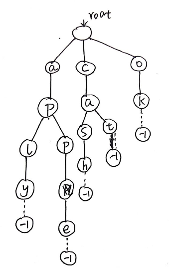
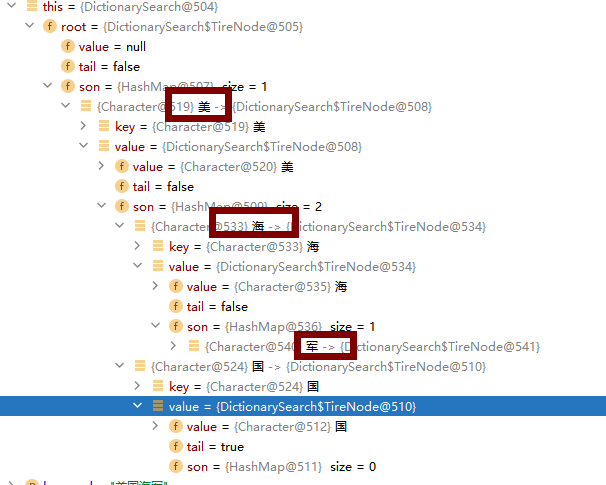

# Trie树
# 引入字典树
字典树，也叫前缀树，顾名思义，干嘛的？首先字典是干嘛的？查找字的。字典树自然也是起查找作用的，只不过是在树上找字的。为啥要在树上找字呢？因为我们都知道树上的操作更加高效。一般查找和更新操作的时间复杂度只与树的高度成正相关（貌似我们所有高效的数据结构都要往树上靠）。
我们先看一下几个问题：
1.我们输入n个单词，然后给出m个查询，每次查询一个单词，需要回答出这个单词是否在之前输入的n单词中出现过。
答：map计数（是STL中一种映射容器map<key,value>，这里key为单词，value为判断是否出现过的bool型标记），短小精悍。
好，那么下一个问题。
2.我们输入n个单词，然后给出m个查询，每次查询一个单词的前缀，需要回答出 这个前缀 是之前输入的n单词中 多少个单词的前缀？
答：我们好像还是可以用map做，把输入n个单词中的每一个单词的前缀分别存入map中，然后计数，那这样真的很麻烦而且时间、空间复杂度会非常的高。若有n个单词，平均每个单词的长度为c，那么时间复杂度就会达到nc，很容易TLE。
在实际的搜索引擎中，当我们在数据库中搜索一个关键字的时候，如何快速准确的进行定位是一个关键的问题，在面临大规模数据的时候，使用暴力的手段往往会造成检索和查找性能的低下，因此我们需要更加高效的数据结构。
这时候我们引入一种新的数据结构：Trie树（字典树）。
# 二、原理
接下来我通过举个具体的例子让大家对字典树的原理有一个清晰的认识，我对cat、cash、apple、aply、ok建立一颗字典树，如下图所示：

# 三、demo运行如图

