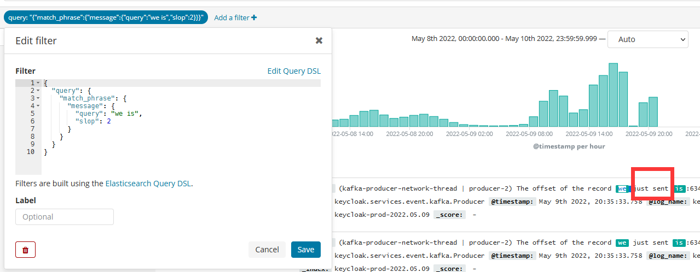

* 索引改名，重键索引
```
// 默认情况下，_reindex使用1000进行批量操作，您可以在source中调整batch_size
POST _reindex
{
  "source": {
    "index": "source",
    "size": 5000
  },
  "dest": {
    "index": "dest",
  }
}
```
* 复制索引
```
http://192.168.0.204:9200/_reindex
POST
{
  "source": {
    "index": "lind-test"
  },
  "dest": {
    "index": "lind-test-new"
  }
}
```
* term和terms查询
```
http://192.168.60.136:9200/
POST
houyi_qikan_upload_journal_dev44/_search
// 单条term
{
  "query": {
    "term": {
      "_id": "1520916933"
    }
  }
}
// 数组terms
{
  "query": {
    "terms": {
      "_id": [
        "7adfc0f09c4155bdc7283bf06cf560bb",
        "1520916862"
      ]
    }
  }
}
```
* range范围
```
{
  "from": 1,
  "size": 5,
  "query": {
    "range": {
      "_create_time": {
        "gte": "2021-06-01"
      }
    }
  }
}
```
* 对数组元素products统计个数
```
GET test_index_8088/_doc/_search
{
  "size":0,
  "aggs": {
    "productNum": {
      "sum": {
        "script": {
          "source": "params._source.products.size()"
        }
      }
    }
  }
}
```
* 删除索引里的所有数据
```
POST http://192.168.60.136:9200/nvwa_source_pfnl_dev73/_delete_by_query
{
  "query": {
    "match_all": {}
  }
}
```
* 排序和分页
```
//根据条件查询分页 排序post ip:9200/person/man/_search
{
  "from": 1,
  "size": 5,
  "sort": [
    {
      "_create_time": {
        "order": "desc"
      }
    }
  ],
  "query": {
    "range": {
      "_create_time": {
        "gte": "2021-06-01"
      }
    }
  }
}
```
* 分词查询match
```
{
    "size":5,
    "query": {
        "match" : {
            "content" : "王某从事中医职业"
        }
    }
}
// 分词匹配操作
{
    "size":5,
    "query": {
        "match" : {
            "content" : {
                "query" : "王某从事中医职业",
                "operator" : "and"
            }
        }
    }
}
```
* match_phrase高级分词
```
GET test_index/_search
{
    "query": {
        "match_phrase" : {
            "message" : {
                "query" : "东方宾馆",
                "slop" : 2
            }
        }
    }
}
```
* proximity相似性
> slop 注：proximity match= match phrase+ slop
```
    GET /forum/article/_search
    {
        "query": {
            "match_phrase": {
                "title": {
                    "query": "java spark",
                    "slop":  3
                }
            }
        }
    }

```
分析：
```
query string，搜索文本，中的几个term，要经过几次移动才能与一个document匹配，这个移动的次数，就是slop

实际举例，一个query string经过几次移动之后可以匹配到一个document，然后设置slop

hello world, java is very good, spark is also very good.

java spark，match phrase，搜不到

如果我们指定了slop，那么就允许java spark进行移动，来尝试与doc进行匹配

java        is        very        good        spark        is

java        spark
java        -->        spark
java                -->        spark
java                        -->            spark

这里的slop，就是3，因为java spark这个短语，spark移动了3次，就可以跟一个doc匹配上了

slop的含义，不仅仅是说一个query string terms移动几次，跟一个doc匹配上。一个query string terms，最多可以移动几次去尝试跟一个doc匹配上

slop，设置的是3，那么就ok
```
例子如图，找到了slop为2的词`we is`


* 统计数量
POST nvwa_source_pfnl_prod77/info/_count
{
  "query": {
    "range": {
      "_create_time": {
        "gte": "2021-08-01"
      }
    }
  }
}
```
#es在给文本分词的时候，除了分词之外还有一个词条标记，就是position，例如我按照standard对以上三个doc的name进行分词会变成这样：
doc[1]：广[0],州[1],东[2],方[3],宾[4],馆[5],酒[6],店[7]；

doc[2]：广[0],州[1],花[2],园[3],宾[4],馆[5],酒[6],店[7]；

doc[3]：东[0],方[1],公[2],园[3],宾[4],馆[5]；

query文本分词：东[0],方[1],宾[2],馆[3]；
```
使用match_phrase时：

1.es会先过滤掉不符合的query条件的doc，即doc[2]中没有"东方"两个词汇，会被过滤掉

2.es会根据分词的position对分词进行过滤和评分，这个是就slop参数，默认是0，意思是查询分词只需要经过距离为0的转换就可以变成跟doc一样的文档数据，例如：对于doc[1]来说slop就是0了，对于doc[3]slop就是2，即"宾"和"馆"最大位移这两个分词只需要最多移动2个位置就可以变成"东方宾馆"（反过来也一样，query的文本中的"宾"和"馆"只需要移动2个位置就可以变成"东方**宾馆"）,用数学的理解就是doc[3]的宾[4]-东[0]=4，query文本中的宾[2]-东[0]=2，那么转换距离slop就是4-2=2，同理doc[3]的馆[5]-东[0]=5，query的是3，slop结果也是2，那么"宾"和"馆"最大的slop就是2，则query时设置slop等于2就能把doc[3]匹配出来，当设置为0时就是我们数据库的"like"

* 对查询进行评分
```
{
  "query": {
    "match": {
      "content": "王某从事中医职业"
    }
  },
  "rescore": {
    "window_size": 30,
    "query": {
      "rescore_query": {
        "match_phrase": {
          "content": {
            "query": "王某从事中医职业",
            "slop": 0
          }
        }
      }
    }
  }
}
```

* fuzzy
这里讲解一下fuzzy和match_phrase的区别

1.fuzzy是词/项级别的模糊匹配,match_phrase是基于短语级别的

例如对于英文(standard分析器)来说"dog cat bird"来说"dog"就是一个词/词项,而"dog cat"就是一个短语,因此作用范围不一样

2.fuzzy是基于莱文斯坦距离的,所以fuzzy是可以容错的例如你输入"dcg" 你也可以匹配到"dog cat bird",但是这里注意的是你的查询只能是单词条的查询,不能"dcg cat",如果你需要查询短语里面的拼写错误,可以使用match的fuzziness参数，match_phrase是不允许出现不存在的词条的。

下面是对于fuzzy和match_phrase和match 添加fuzziness参数进行对比
```
// 这样是可以匹配到"东方宾馆"的数据的,但是无法匹配"广州东方宾馆"因为莱文斯坦距离已经不止1了
GET test_save/_search
{
  "query": {
    "fuzzy": {
      "content.keyword":{
        "value": "王某从事中医职业",
        "fuzziness": 1
      }
    }
  }
}
```
* nested
path表示nested字段名，include表示只返回某个字段，range表示范围，from表示从哪个值开始
```
{
  "_source": {
    "include": [
      "_id",
      "operate"
    ]
  },
  "query": {
    "bool": {
      "must": [
        {
          "nested": {
            "path": "operate",
            "query": {
              "bool": {
                "must": [
                  {
                    "term": {
                      "operate.operateType": "WangLu"
                    }
                  },
                  {
                    "range": {
                      "operate.actionTime": {
                        "from": "2020-12-03"
                      }
                    }
                  },
                  {
                    "term": {
                      "operate.userName": "admin"
                    }
                  }
                ]
              }
            }
          }
        }
      ]
    }
  }
}
```
* 返回指定字段`CaseFlag`
```
{
  "size": 15,
  "_source":["CaseFlag"],
  "query": {
    "term": {
      "CaseFlag": "民"
    }
  }
}
```
* 查询数据字段的长度大于10的
```
{
  "size": 5,
  "query": {
    "bool": {
      "filter": {
        "script": {
          "script": {
            "source": "doc['AccordingLaw.keyword'].values.length > 10",
            "lang": "painless"
          }
        }
      }
    }
  }
}
```
* nested类型的检索
```
{
  "query": {
    "bool": {
      "must": [
        {
          "nested": {
            "path": "operate",
            "query": {
              "bool": {
                "must": [
                  {
                    "range": {
                      "operate.actionTime": {
                        "gte": "2020-12-25"
                      }
                    }
                  }
                ]
              }
            }
          }
        }
      ]
    }
  }
}
```
# 聚合分析
> object类型不支持聚合，nested类型是支持的

* 对nested类型查询，并且对nested类型再分组
```
{
  "size": 0,
  "query": {
    "bool": {
      "must": [
        {
          "nested": {
            "path": "operate",
            "query": {
              "bool": {
                "must": [
                  {
                    "range": {
                      "operate.actionTime": {
                        "gte": "2020-12-25"
                      }
                    }
                  }
                ]
              }
            }
          }
        }
      ]
    }
  },
  "aggs": {
    "operate": {
      "nested": {
        "path": "operate"
      },
      "aggs": {
        "count1": {
          "terms": {
            "field": "operate.userName"
          }
        }
      }
    }
  }
}
```
结果会把文档数`hits.total`，分组总数`aggregations.doc_count`，分组结果都类聚出来
```
{
"took": 25608,
"timed_out": false,
"_shards": {
"total": 80,
"successful": 80,
"skipped": 0,
"failed": 0
},
"hits": {
"total": 70467031,
"max_score": 0,
"hits": [ ]
},
"aggregations": {
"operate": {
"doc_count": 325866399,
"count1": {
"doc_count_error_upper_bound": 68973,
"sum_other_doc_count": 3040044,
"buckets": [
{
"key": "zidongluru",
"doc_count": 154418483
}
,
{
"key": "admin",
"doc_count": 91409341
}
,
{
"key": "znweichuli",
"doc_count": 48963944
}
,
{
"key": "qinbixue1609",
"doc_count": 20721597
}
,
{
"key": "zhangyang1308",
"doc_count": 4385245
}
,
{
"key": "peng",
"doc_count": 1734723
}
,
{
"key": "xuminxia",
"doc_count": 492742
}
,
{
"key": "mxy",
"doc_count": 270408
}
,
{
"key": "wzm",
"doc_count": 250162
}
,
{
"key": "gaoyuan1309",
"doc_count": 179616
}
]
}
}
}
}
```
* 对nested类型operate中的userName进行分组统计数量
```
{
  "size": 0,
  "query": {
    "bool": {
      "must": [
        {
          "term": {
            "UniqueID": "d11501f00add306b8a51b38a1d718a31"
          }
        }
      ]
    }
  },
  "aggs": {
    "operate": {
      "nested": {
        "path": "operate"
      },
      "aggs": {
        "count1": {
          "terms": {
            "field": "operate.userName"
          }
        }
      }
    }
  }
}
```

*  对名称中包含yagao的商品，计算每个tag下的商品数量
```
GET /ecommerce/product/_search
{
   "size": 0,
   "query": {
     "match": {
       "name": "yaogao"
     }
   },
   "aggs": {
     "all_tags": {
       "terms": {
         "field": "tags"
       }
     }
   }
}
```
* 先分组，再算每组的平均值，计算每个tag下的商品的平均价格
```
GET /ecommerce/product/_search
{
   "size": 0,
   "aggs": {
     "group_by_tags": {
       "terms": {
         "field": "tags"
       },
       "aggs": {
         "avg_price": {
           "avg": {
             "field": "price"
           }
         }
       }
     }
   }
}
```
* 计算每个tag下的商品的平均价格，并且按照平均价格降序排序
```
GET /ecommerce/product/_search
{
   "size": 0,
   "aggs": {
     "all_tags": {
       "terms": {
         "field": "tags",
         "order": {
           "avg_price": "asc"
         }
       },
       "aggs": {
         "avg_price": {
           "avg": {
             "field": "price"
           }
         }
       }
     }
   }
}
```
* 按照指定的价格范围区间进行分组，然后在每组内再按照tag进行分组，最后再计算每组的平均价格
```
GET /ecommerce/product/_search
{
   "size": 0,
   "aggs": {
     "group_by_price": {
       "range": {
         "field": "price",
         "ranges": [
           {
             "from": 0,
             "to": 20
           },{
             "from": 20,
             "to": 40
           },{
             "from": 40,
             "to": 50
           }
         ]
       },
       "aggs": {
         "all_tags": {
           "terms": {
             "field": "price"
           },
           "aggs": {
             "avg_price": {
               "avg": {
                 "field": "price"
               }
             }
           }
         }
       }
     }
   }
}
```
* 统计数组元素的数量
```
{
  "size": 0,
  "query": {
    "bool": {
      "must": [
        {
          "range": {
            "UpdateTime": {
              "gte": "2020-11-15"
            }
          }
        }
      ]
    }
  },
  "aggs": {
    "productNum": {
      "sum": {
        "script": {
          "source": "params._source.operate.size()"
        }
      }
    }
  }
}
```
* 查看nest类型operate.userName不是admin的文档，并且数组CaseClass中所有元素都不是001的文档，目前script里的字段不支持`nested`类型
```
{
  "query": {
    "bool": {
      "must_not": [
        {
          "nested": {
            "path": "operate",
            "query": {
              "term": {
                "operate.userName": "admin"
              }
            }
          }
        }
      ],
      "must": [
        {
          "term": {
            "_id": "1970325147248066"
          }
        },
        {
          "script": {
            "script": {
              "source": "doc.CaseClass.stream().filter(val -> val == '001').count() == 0"
                        }
          }
        }
      ]
    }
  }
}
```
* 下面检索时，需要对nested数组类型中的每个元素进行匹配
> 参考：https://learnku.com/articles/45662
```
{
  "query": {
    "bool": {
      "must_not": [
        {
          "nested": {
            "path": "operate",
            "query": {
              "term": {
                "operate.userName": "admin"
              }
            }
          }
        }
      ],
      "must": [
        {
          "term": {
            "_id": "1970325147248066"
          }
        },
        {
          "nested": {
            "path": "operate",
            "query": {
              "script": {
                "script": {
                  "source": "doc['operate.userName'].stream().filter(val -> val== 'admin').count() == 0"
                }
              }
            }
          }
        }
      ]
    }
  }
}
```
* 更新某条记录
```
curl -XPOST 'http://192.168.10.146:9200/nvwa_pfnl_dev75/info/1970324936941056/_update' -d '{"doc":{"IfDeepProcessing":0}}'
# 响应
{
    "_index": "nvwa_pfnl_dev75",
    "_type": "info",
    "_id": "1970324936941056",
    "_version": 5,
    "result": "updated",
    "_shards": {
    "total": 2,
    "successful": 2,
    "failed": 0
    },
    "_seq_no": 603804,
    "_primary_term": 15
}
```
