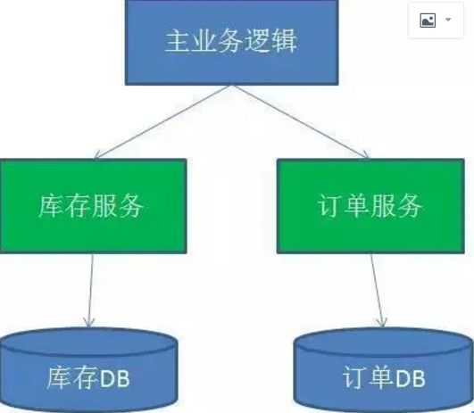
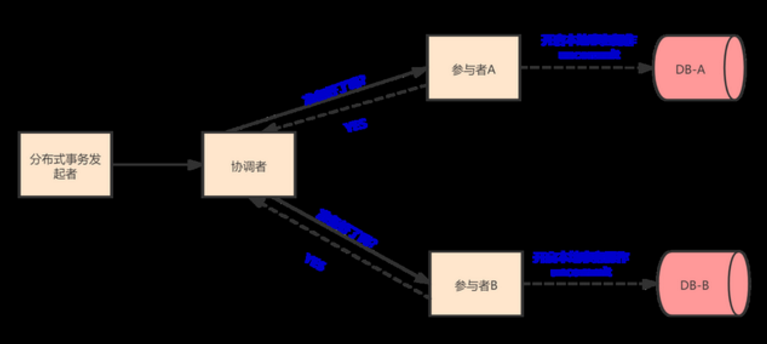
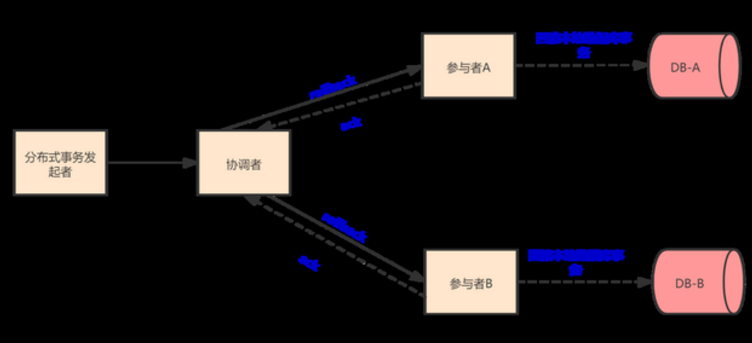
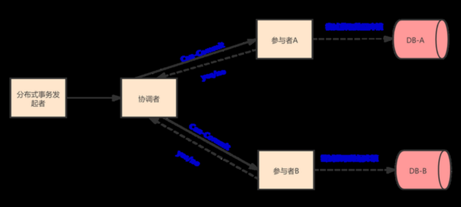
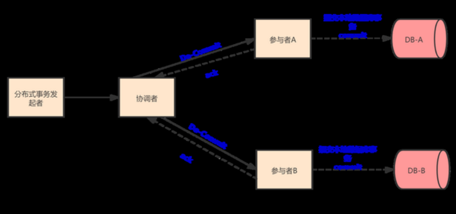
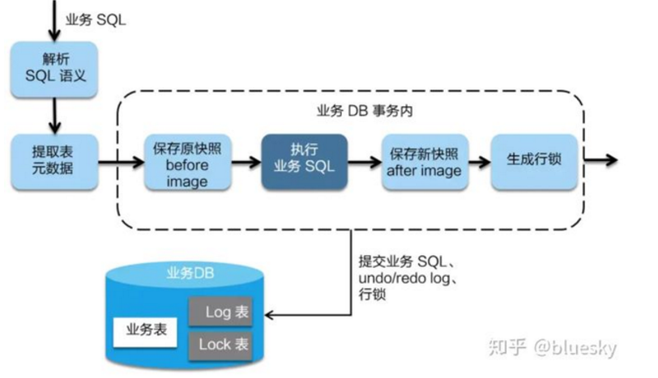
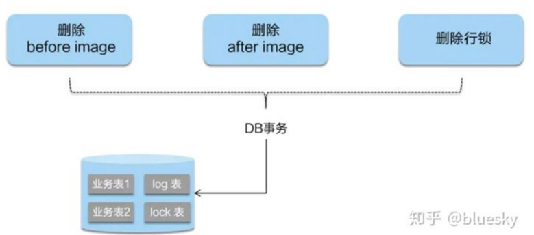
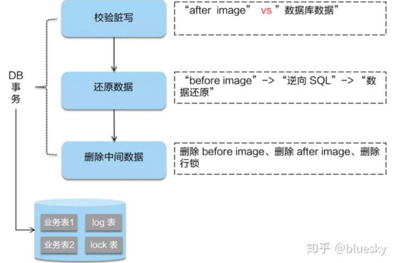
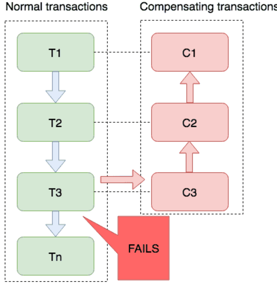

# 一、SEATA是什么？
Seata 是一款开源的分布式事务解决方案，致力于提供高性能和简单易用的分布式事务服务。Seata 将为用户提供了 AT、TCC、SAGA 和 XA 事务模式，为用户打造一站式的分布式解决方案。
在继续学习使用SEATA之前，对seata介绍中提到的分布式事务、AT、TCC、SAGA 和 XA 事务模式这些名词有必要介绍一下。
## 1.什么是分布式事务？
首先说下事务，事务是应用程序中一系列严密的操作，所有操作必须成功完成，否则在每个操作中所作的所有更改都会被撤消。
事务应该具有 4 个属性：原子性、一致性、隔离性、持久性。这四个属性通常称为 ACID 特性。
事务更多指的是单机版、单数据库的概念。分布式事务用于在分布式系统中保证不同节点之间的数据一致性。

## 2. XA规范
有了分布式事务的场景，就会有解决该问题的方式规范，XA规范就是解决分布式事务的规范。分布式事务的实现方式有很多种，最具有代表性的是由
Oracle Tuxedo[美 /tʌkˈsiːdoʊ/]系统提出的XA分布式事务协议。XA协议包括`两阶段提交（2PC）`和`三阶段提交（3PC）`两种实现。
### 两阶段提交（2PC）
两阶段提交又称2PC（two-phase commit protocol）,2pc是一个非常经典的强一致、中心化的原子提交协议。这里所说的中心化是指协议中有两类节
点：一个是中心化协调者节点（coordinator）和N个参与者节点（partcipant）。
* 准备阶段:事务协调者，向所有事务参与者发送事务内容，询问是否可以提交事务，并等待参与者回复。 
* 事务参与者收到事务内容，开始执行事务操作，讲 undo 和 redo 信息记入事务日志中（但此时并不提交事务）。
* 如果参与者执行成功，给协调者回复yes,表示可以进行事务提交。
* 如果执行失败，给协调者回复no,表示不可提交。

### XA一阶段提交
* 提交阶段如果协调者收到了参与者的失败信息或超时信息，直接给所有参与者发送回滚（rollback）信息进行事务回滚 否则，发送提交（commit）信息。
* 参与者根据协调者的指令执行提交或者回滚操作，释放所有事务处理过程中使用的锁资源。(注意：必须在最后阶段释放锁资源) 。

xa规范2pc异常提交阶段
以下几点是XA-两阶段提交协议中会遇到的一些问题：
* 性能问题
从流程上我们可以看得出，其最大缺点就在于它的执行过程中间，节点都处于阻塞状态。各个操作数据库的节点此时都占用着数据库资源，只有当所有节点准备完毕，事务协调者才会通知进行全局提交，参与者进行本地事务提交后才会释放资源。这样的过程会比较漫长，对性能影响比较大。
* 协调者单点故障问题
事务协调者是整个XA模型的核心，一旦事务协调者节点挂掉，会导致参与者收不到提交或回滚的通知，从而导致参与者节点始终处于事务无法完成的中间状态。
丢失消息导致的数据不一致问题
在第二个阶段，如果发生局部网络问题，一部分事务参与者收到了提交消息，另一部分事务参与者没收到提交消息，那么就会导致节点间数据的不一致问题。
2PC 方案实现起来简单，基于上面提到的两阶段提交协议中会遇到的问题，实际项目中使用的比较少。那么有没有其他的方案来解决呢？
### 三阶段提交（3PC）
三阶段提交是在二阶段提交上的改进版本，其在两阶段提交的基础上增加了 CanCommit阶段，并加入了超时机制。同时在协调者和参与者中都引入超时机制。三阶段将二阶段的准备阶段拆分为2个阶段，插入了一个preCommit阶段，以此来处理原先二阶段，参与者准备后，参与者发生崩溃或错误，导致参与者无法知晓是否提交或回滚的不确定状态所引起的延时问题。
阶段 1：canCommit
协调者向所有参与者发出包含事务内容的 canCommit 请求，询问是否可以提交事务，并等待所有参与者答复。
参与者收到 canCommit 请求后，如果认为可以执行事务操作，则反馈 yes 并进入预备状态，否则反馈 no。

xa规范3pc-canCommit
阶段 2：preCommit
阶段一中，如果所有的参与者都返回Yes的话，那么就会进入PreCommit阶段进行事务预提交。此时分布式事务协调者会向所有的参与者节点发送PreCommit请求，参与者收到后开始执行事务操作，并将Undo和Redo信息记录到事务日志中。参与者执行完事务操作后（此时属于未提交事务的状态），就会向协调者反馈“Ack”表示我已经准备好提交了，并等待协调者的下一步指令。如果阶段一中有任何一个参与者节点返回的结果是No响应，或者协调者在等待参与者节点反馈的过程中因挂掉而超时（2PC中只有协调者可以超时，参与者没有超时机制）。整个分布式事务就会中断，协调者就会向所有的参与者发送“abort”请求。

xa规范3pc-doCommit
相比较2PC而言，3PC对于协调者（Coordinator）和参与者（Partcipant）都设置了超时时间，而2PC只有协调者才拥有超时机制。这解决了一个什么问题呢？这个优化点，主要是避免了参与者在长时间无法与协调者节点通讯（协调者挂掉了）的情况下，无法释放资源的问题，因为参与者自身拥有超时机制会在超时后，自动进行本地commit从而进行释放资源。而这种机制也侧面降低了整个事务的阻塞时间和范围。
另外，通过CanCommit、PreCommit、DoCommit三个阶段的设计，相较于2PC而言，多设置了一个缓冲阶段保证了在最后提交阶段之前各参与节点的状态是一致的。
以上就是3PC相对于2PC的一个提高（相对缓解了2PC中的前两个问题），但是3PC依然没有完全解决数据不一致的问题。假如在 DoCommit 过程，参与者A无法接收协调者的通信，那么参与者A会自动提交，但是提交失败了，其他参与者成功了，此时数据就会不一致。
## 3. AT(Auto Transaction)模式
AT 模式是一种无侵入的分布式事务解决方案。在 AT 模式下，用户只需关注自己的“业务 SQL”，用户的 “业务 SQL” 作为一阶段，Seata 框架会自动生成事务的二阶段提交和回滚操作。
AT 模式如何做到对业务的无侵入
一阶段
在一阶段，Seata 会拦截“业务 SQL”，首先解析 SQL 语义，找到“业务 SQL”要更新的业务数据，在业务数据被更新前，将其保存成“before image”，然后执行“业务 SQL”更新业务数据，在业务数据更新之后，再将其保存成“after image”，最后生成行锁。以上操作全部在一个数据库事务内完成，这样保证了一阶段操作的原子性。
以update语句为例：
update user set name = 'name_1' where name = 'name_0'
首先 Seata 的 JDBC数据源代理通过对业务 SQL 解析，提取 SQL 的元数据，也就是得到 SQL 的类型（UPDATE），表（user），条件（where id= 1）等相关的信息。
提取表元数据：
select id,name from user where name = 'name_0'
将查询到的结果如上图所示保存为“before image”，执行“业务 SQL”更新业务数据SQL。根据前镜像数据主键查询出后镜像数据，查询结果为：
select id,name from user where id = 1
把业务数据在更新前后的数据镜像组织成回滚日志，将业务数据的更新和回滚日志在同一个本地事务中提交，分别插入到业务表和 UNDO_LOG 表中。

### 二阶段提交
二阶段如果是提交的话，因为“业务 SQL”在一阶段已经提交至数据库， 所以 Seata 框架只需将一阶段保存的快照数据和行锁删掉，完成数据清理即可。

### 二阶段回滚
二阶段如果是回滚的话，Seata 就需要回滚一阶段已经执行的“业务 SQL”，还原业务数据。回滚方式便是用“before image”还原业务数据；但在还原前要首先要校验脏写，对比“数据库当前业务数据”和 “after image”，如果两份数据完全一致就说明没有脏写，可以还原业务数据，如果不一致就说明有脏写，出现脏写就需要转人工处理。

### 总结
AT 模式的一阶段、二阶段提交和回滚均由 Seata 框架自动生成，用户只需编写“业务 SQL”，便能轻松接入分布式事务，AT 模式是一种对业务无任何侵入的分布式事务解决方案。但AT模式存在的不足就是 当操作的数据 是共享型数据，会存在脏写的问题，所以如果是 用户独有数据可以使用AT模式。

## 4.TCC(Try、Confirm、Cancel)模式
TCC方案其实是两阶段提交的一种改进。分成了Try、Confirm、Cancel三个操作。事务发起方在一阶段执行 Try 方式，在二阶段提交执行 Confirm 方法，二阶段回滚执行 Cancel 方法。@TwoPhaseBusinessAction是TCC服务参与者必须加的注解，指定服务名称，提交方法commitMethod及回滚方法rollbackMethod，SecondAction同理
* Try部分完成业务的准备工作
* confirm部分完成业务的提交
* cancel部分完成事务的回滚
TCC 模式，不依赖于底层数据资源的事务支持：
* 一阶段 prepare 行为：调用 自定义 的 prepare 逻辑。
* 二阶段 commit 行为：调用 自定义 的 commit 逻辑。
* 二阶段 rollback 行为：调用 自定义 的 rollback 逻辑。 所谓 TCC 模式，是指支持把 自定义 的分支事务纳入到全局事务的管理中。简单点概括，SEATA的TCC模式就是手工的AT模式，它允许你自定义两阶段的处理逻辑而不依赖AT模式的undo_log。
* @LocalTCC 适用于SpringCloud+Feign模式下的TCC
* @TwoPhaseBusinessAction 注解try方法，其中name为当前tcc方法的bean名称，写方法名便可（记得全局唯一），commitMethod指向提交方法，rollbackMethod指向事务回滚方法。指定好三个方法之后，seata会根据全局事务的成功或失败，去帮我们自动调用提交方法或者回滚方法。
* @BusinessActionContextParameter 注解可以将参数传递到二阶段（commitMethod/rollbackMethod）的方法。
* BusinessActionContext 便是指TCC事务上下文
### TCC实践,总结以下注意事项:
业务模型分2阶段设计  并发控制  允许空回滚  防悬挂控制  幂等控制
用户接入 TCC 模式，最重要的事情就是考虑如何将业务模型拆成 2 阶段，实现成 TCC 的 3 个方法，并且保证 Try 成功 Confirm 一定能成功。相对于 AT 模式，TCC 模式对业务代码有一定的侵入性，但是 TCC 模式无 AT 模式的全局行锁，TCC 性能会比 AT 模式高很多。

## 5.SAGA模式
### SAGA简介
Saga模式是SEATA提供的长事务解决方案，在Saga模式中，业务流程中每个参与者都提交本地事务，当出现某一个参与者失败则补偿前面已经成功的参与者，一阶段正向服务和二阶段补偿服务都由业务开发实现。
### Saga模式示意图

如图：T1-T3都是正向的业务流程，都对应着一个冲正逆向操作C1-C3。
分布式事务执行过程中，依次执行各参与者的正向操作，如果所有正向操作均执行成功，那么分布式事务提交。如果任何一个正向操作执行失败，那么分布式事务会退回去执行前面各参与者的逆向回滚操作，回滚已提交的参与者，使分布式事务回到初始状态。
Saga 正向服务与补偿服务也需要业务开发者实现。因此是业务入侵的。
Saga 模式下分布式事务通常是由事件驱动的，各个参与者之间是异步执行的，Saga 模式是一种长事务解决方案。
### Saga 模式使用场景
Saga 模式适用于业务流程长且需要保证事务最终一致性的业务系统，Saga 模式一阶段就会提交本地事务，无锁、长流程情况下可以保证性能。
事务参与者可能是其它公司的服务或者是遗留系统的服务，无法进行改造和提供 TCC 要求的接口，可以使用 Saga 模式。
### Saga模式的优势与缺点
#### 优势
* 一阶段提交本地数据库事务，无锁，高性能；
* 参与者可以采用事务驱动异步执行，高吞吐
* 补偿服务即正向服务的“反向”，易于理解，易于实现；
#### 缺点
Saga 模式由于一阶段已经提交本地数据库事务，且没有进行“预留”动作，所以不能保证隔离性。后续会讲到对于缺乏隔离性的应对措施。
注意
与TCC实践经验相同的是，Saga 模式中，每个事务参与者的冲正、逆向操作，需要支持：
* 空补偿：逆向操作早于正向操作时；
* 防悬挂控制：空补偿后要拒绝正向操作
* 幂等

## 总结 AT、TCC、Saga、XA 模式分析
四种分布式事务模式，分别在不同的时间被提出，每种模式都有它的适用场景：
* AT 模式是无侵入的分布式事务解决方案，适用于不希望对业务进行改造的场景，几乎0学习成本。
* TCC 模式是高性能分布式事务解决方案，适用于核心系统等对性能有很高要求的场景。
* Saga 模式是长事务解决方案，适用于业务流程长且需要保证事务最终一致性的业务系统，Saga 模式一阶段就会提交本地事务，无锁，长流程情况下可以保证性能，多用于渠道层、集成层业务系统。事务参与者可能是其它公司的服务或者是遗留系统的服务，无法进行改造和提供 TCC 要求的接口，也可以使用 Saga 模式。
* XA模式是分布式强一致性的解决方案，但性能低而使用较少。
# 二.SEATA术语
* TC (Transaction Coordinator) - 事务协调者
维护全局和分支事务的状态，驱动全局事务提交或回滚。
* TM (Transaction Manager) - 事务管理器
定义全局事务的范围：开始全局事务、提交或回滚全局事务。
* RM (Resource Manager) - 资源管理器
管理分支事务处理的资源，与TC交谈以注册分支事务和报告分支事务的状态，并驱动分支事务提交或回滚。
