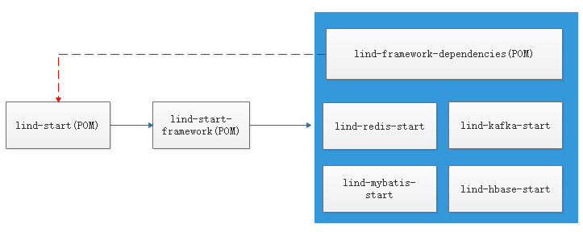
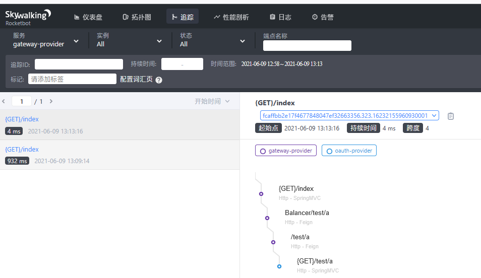

# 项目介绍 
主要是由框架级工具进行封装，springboot的start包的使用，完成对工具包的自动注入，所有start包的版本都继承lind-framework的版本

> 目前正在开发基于最新的springboot2.7的精简版本lind-fast框架

# 升级
* 命令行执行 mvn versions:set -DnewVersion=1.1.3-SNAPSHOT //更新整个项目版本,SNAPSHOT的同一个版本可以多次发到仓库里
* 提交 mvn versions:commit //提交，删除多余的pom.xml.versionsBackup
* mvn deploy 根项目
* 先deploy lind-framework-bom项目，再deploy lind-framework项目


# 为什么程序员都喜欢用16进制，因为它简单
> 千分割符读数技巧:第一个逗号前面是千，第二个是百万，第三个是十亿
|2的指数|10进制|16进制|
|--|--|--|
|2^4-1|15|F|
|2^8-1|255|FF|
|2^12-1|4,095|FFF|
|2^16-1|65,535|FFFF|
|2^20-1|1,048,575|FFFFF|
|2^24-1|16,777,215|FFFFFF|
|2^28-1|268,435,456|FFFFFFF|
|2^32-1|4,294,967,296|FFFFFFFF|
# 项目结构


# lind-start-framework项目介绍（springboot）
以lind开头，以start结尾的项目，是其它项目的基础包
lind-start项目结构
* demo 一些测试项目
* lind-framework-bom lind组件和相关依赖清单，需要使用lind组件，需要import这个包
* lind-framework 组件包
   * lind-activiti 工作流组件
   * lind-common 公用工具包
   * lind-elasticsearch-start 封装了es7.x的操作，工厂模块完成对类型的动态转换
   * lind-feign-start 接口调用组件
   * lind-hbase-start 封装了hbase的操作，封装了常用字段，AOP完成赋值
   * lind-kafka-start 封装了kafka工具，动态代理实现生产者
   * lind-logback-start 对日志输出规范的封装，集成了traceId和ip等
   * lind-logger-start 日志拦截器，记录行为日志
   * lind-mybatis-start 封装了mybatis plus的操作
   * lind-nacos-start 统一了nacos的版本，添加了配置热更新demo
   * lind-office-convert 封装了对excel,word的操作
   * lind-rbac-start 用户角色管理相关的封装
   * lind-redis-start 对redis的封装，序列化的统一，分布锁组件， 限流组件
   * lind-schedule 任务调组件
   * lind-spi java原生的插件组件
   * lind-uaa-jwt-start 基于JWT的授权组件
   * lind-uaa-keycloak-start 基于keycloak的授权组件
   * lind-uaa-start 用户授权组件
   * lind-verification-code-start 验证码组件

# maven的执行阶段
```
    clean: 删除项目路径下的target文件，但是不会删除本地的maven仓库已经生成的jar文件.
    complie:对项目进行编译,生成target文件,但是不会生成jar包
    package:在compile的基础上,会在target文件目录下生成jar包,但是该jar包并没有放到本地仓库里.
    install:在package的基础上,会把生成的jar包放到本地仓库中,这个时候,如果项目A依赖项目B,A的pom文件导入B的依赖就可以找到了,否则找不到.
    deploy: 会把生成的jar包push到远程仓库去,这样项目发布到服务器上就可以实现项目A依赖项目B了.
```
# springloaded热部署
```$xslt
java -javaagent:springloaded-1.2.5.RELEASE.jar -noverify -Dspringloaded="watchJars=a-start-hot-dependency-1.0.0.jar"   -jar a-start-hot-deploy-1.0.0.jar
jar -uvf a-start-hot-deploy-1.0.0.jar    BOOT-INF/lib/a-start-hot-dependency-1.0.0.jar #更新
```

# 自定义start的方法
1. 建立新的工程，主要用来实现某个功能，如redis,mongodb的封装，方便调用
2. 添加配置类，有一些配置信息，可以在application.yml里去配置
3. 添加AutoConfigure类，主要定义这个工具的规则
4. 添加META-INF文件夹spring.factories文件，用来指定自动装配的AutoConfigure类

# spring.factories
  springboot-start项目里，通过spring.factories进行自动注册，里面可以设置自动配置，自动监听，应用初始化，配置文件类型，环境变量等信息，
在我们封装扩展包时，可以使用这个文件帮使用者自动装配bean。
  如果不希望自动装配你的bean，可以为bean添加Enable开头的注解，类似于`EnableResourceServer`,`EnableAuthorizationServer`等。

# 项目里的公用包
1. 公用工具包一般是util，它是单数，事实上包的命名都是单数
2. util包里的类，一般用utils结尾，它是复数，这也是遵循国际上公用类库的一个标准，如com.google.guava和org.apache.commons.lang3里的类命名方式。

# 测试项目
1. a-start-gateway
2. a-start-oauth
3. a-start-test
4. a-start-test-depend &  a-start-test-depend-shade

# 问题和解决
 springboot启动后自动退出，可以添加tomcat包解决这个问题
 ```
    <dependency>
        <groupId>org.springframework.boot</groupId>
        <artifactId>spring-boot-starter-tomcat</artifactId>
    </dependency>
docker-compose -f example/standalone-mysql.yaml up
 ```

# 项目报告
mvn site
> 注意：上面的命令速度非常慢，因为它要检测每个包是否在仓库里，可以添加`-Ddependency.locations.enabled=false`来关闭这个校验,这个主要针对spotsbug,checkstyle,PMD,test等进行文档报告的打针，运行时间比较长，单独执行某些任务也是可以的，
如下面只执行checkstyle,spotbugs,pmd: mvn compile -D maven.test.skip=true clean compile spotbugs:spotbugs  checkstyle:checkstyle 

* mvn site -Ddependency.locations.enabled=false
```
<!-- 代码检查 -->
<plugin>
    <groupId>org.apache.maven.plugins</groupId>
    <artifactId>maven-checkstyle-plugin</artifactId>
    <version>3.1.1</version>
    <executions>
        <execution>
            <id>checkstyle</id>
            <phase>validate</phase>
            <goals>
                <goal>check</goal>
            </goals>
        </execution>
    </executions>
    <dependencies>
        <dependency>
            <groupId>com.puppycrawl.tools</groupId>
            <artifactId>checkstyle</artifactId>
            <version>8.29</version>
        </dependency>
    </dependencies>
    <configuration>
        <configLocation>/checkstyle.xml</configLocation>
        <encoding>UTF-8</encoding>
        <consoleOutput>true</consoleOutput>
        <failsOnError>true</failsOnError>
    </configuration>
</plugin>
<!-- 配置pmd对java源文件进行检查，检测出可以优化的代码 -->
<plugin>
    <groupId>org.apache.maven.plugins</groupId>
    <artifactId>maven-pmd-plugin</artifactId>
    <version>3.8</version>
</plugin>
<plugin>
    <groupId>com.github.spotbugs</groupId>
    <artifactId>spotbugs-maven-plugin</artifactId>
    <version>4.0.4</version>
    <dependencies>
        <!-- overwrite dependency on spotbugs if you want to specify the version of spotbugs -->
        <dependency>
            <groupId>com.github.spotbugs</groupId>
            <artifactId>spotbugs</artifactId>
            <version>4.1.2</version>
        </dependency>
    </dependencies>
</plugin>
<!-- 测试报告 -->
<plugin>
    <groupId>org.apache.maven.plugins</groupId>
    <artifactId>maven-surefire-plugin</artifactId>
    <version>2.22.2</version>
    <configuration>
        <skip>false</skip>
        <skipTests>false</skipTests><!-- false不跳过测试,true表示跳过测试项目-->
        <testFailureIgnore>true</testFailureIgnore>
    </configuration>
</plugin>
<!-- mvn site时使用 -->
<plugin>
    <groupId>org.apache.maven.plugins</groupId>
    <artifactId>maven-site-plugin</artifactId>
    <version>3.8.2</version>
</plugin>
<plugin>
    <groupId>org.apache.maven.plugins</groupId>
    <artifactId>maven-project-info-reports-plugin</artifactId>
    <version>3.1.0</version>
</plugin>

```
# 测试报告
 mvn surefire-report:report
```$xslt
 <plugin>
    <groupId>org.apache.maven.plugins</groupId>
    <artifactId>maven-surefire-plugin</artifactId>
    <version>2.22.2</version>
    <configuration>
        <skip>false</skip>
        <skipTests>false</skipTests><!-- false不跳过测试,true表示跳过测试项目-->
        <testFailureIgnore>true</testFailureIgnore>
    </configuration>
</plugin>
```
# skywalking集成
* 添加javaagent参数
```
-javaagent:agent\skywalking-agent.jar -Dskywalking.agent.service_name=gateway-provider -Dskywalking.collector.backend_service=192.168.60.137:30129
# -Dskywalking.agent.service_name  你应用的名称
# -Dskywalking.collector.backend_service skywalking后台服务的grpc地址
```
* 日志采集之后的内容

