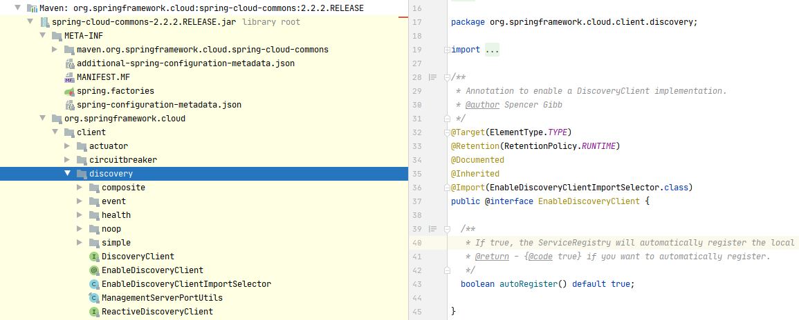
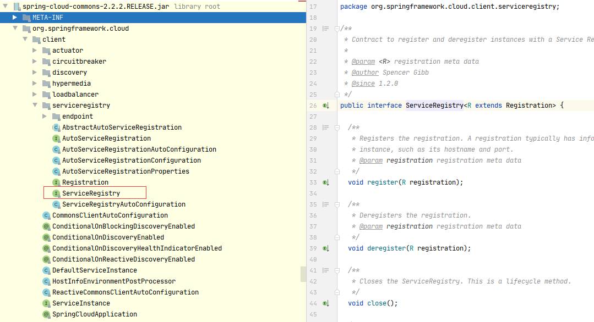
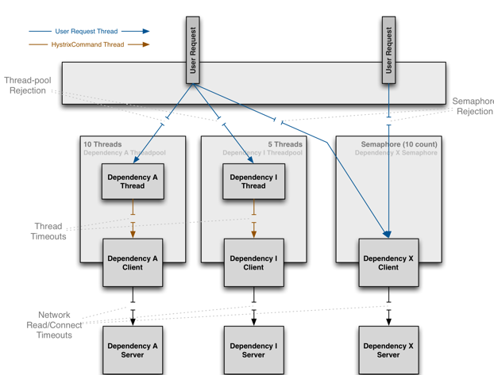

# Bootstrap应用程序上下文
Spring Cloud应用程序通过创建“ bootstrap ”上下文来运行，该上下文是主应用程序的父上下文。它负责从外部源加载配置属性，并负责解密本地外部配置文件中的属性
* 默认情况下，远程配置会覆盖本地配置
* 从任何本地属性源覆盖: spring.cloud.config.overrideNone=true
* 范围刷新： @RefreshScope
* 加密与解密：您可以使用{cipher}*形式的加密值，并且只要存在有效密钥，就可以在主应用程序上下文获得Environment设置之前对它们进行解密
* 端点：对于Spring Boot Actuator应用程序，可以使用一些其他管理端点，/actuator/refresh重新加载引导上下文并刷新@RefreshScope beans，/actuator/restart关闭ApplicationContext并重新启动（默认情况下禁用）。
```
http://localhost:20000/actuator/info 心跳检查

http://localhost:20000/actuator/health 健康检查

http://localhost:20000/actuator/metrics 指标
```
# Spring Cloud Commons 通用抽象
服务发现，负载平衡和断路器之类的模式将它们带到一个通用的抽象层，可以由所有Spring Cloud客户端使用，而与实现无关（例如，使用Eureka或Consul进行的发现） ）。
## @EnableDiscoveryClient
Spring Cloud Commons提供了@EnableDiscoveryClient批注。这将寻找META-INF/spring.factories与DiscoveryClient接口的实现。Discovery Client的实现在org.springframework.cloud.client.discovery.EnableDiscoveryClient键下将配置类添加到spring.factories。DiscoveryClient实现的示例包括Spring Cloud Netflix Eureka，Spring Cloud Consul发现和Spring Cloud Zookeeper发现。

默认情况下，DiscoveryClient的实现会自动将本地Spring Boot服务器注册到远程发现服务器。可以通过在@EnableDiscoveryClient中设置autoRegister=false来禁用此行为。


## 3.2服务注册
Spring Cloud Commons现在提供一个ServiceRegistry接口，该接口提供诸如register(Registration)和deregister(Registration)之类的方法，这些方法使您可以提供自定义的注册服务。Registration是标记界面。

以下示例显示了正在使用的ServiceRegistry：
```
@Configuration
@EnableDiscoveryClient(autoRegister=false)
public class MyConfiguration {
    private ServiceRegistry registry;

    public MyConfiguration(ServiceRegistry registry) {
        this.registry = registry;
    }

    // called through some external process, such as an event or a custom actuator endpoint
    public void register() {
        Registration registration = constructRegistration();
        this.registry.register(registration);
    }
}
```
每个ServiceRegistry实现都有自己的Registry实现。

    ZookeeperRegistration与ZookeeperServiceRegistry一起使用
    EurekaRegistration与EurekaServiceRegistry一起使用
    ConsulRegistration与ConsulServiceRegistry一起使用

如果您使用的是ServiceRegistry接口，则将需要为使用的ServiceRegistry实现传递正确的Registry实现。

# 断路器


## 如何包括Hystrix

要将Hystrix包含在您的项目中，请使用起始者，其组ID为org.springframework.cloud，工件ID为spring-cloud-starter-netflix-hystrix。有关使用当前Spring
Cloud版本Train设置构建系统的详细信息，请参见Spring Cloud项目页面。

以下示例显示了具有Hystrix断路器的最小Eureka服务器：
```
@SpringBootApplication
@EnableCircuitBreaker
public class Application {

    public static void main(String[] args) {
        new SpringApplicationBuilder(Application.class).web(true).run(args);
    }

}

@Component
public class StoreIntegration {

    @HystrixCommand(fallbackMethod = "defaultStores")
    public Object getStores(Map<String, Object> parameters) {
        //do stuff that might fail
    }

    public Object defaultStores(Map<String, Object> parameters) {
        return /* something useful */;
    }
}
```
@HystrixCommand由一个名为“ javanica ”的Netflix contrib库提供。Spring Cloud将带有注释的Spring beans自动包装在与Hystrix断路器连接的代理中。断路器计算何时断开和闭合电路，以及在发生故障时应采取的措施。

要配置@HystrixCommand，可以将commandProperties属性与@HystrixProperty批注一起使用。有关 更多详细信息，请参见 此处。有关 可用属性的详细信息，请参见Hystrix Wiki。

## Hystrix指标流

要启用Hystrix指标流，请包括对spring-boot-starter-actuator的依赖性并设置management.endpoints.web.exposure.include: hystrix.stream。这样做将/actuator/hystrix.stream作为管理端点公开
